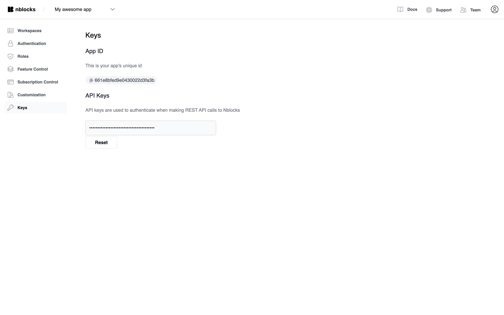

# Accessing your app id and api key

## Access via Nblocks Admin
Login to [Nblocks Admin](https://admin.nblocks.cloud) and navigate to your app's key tab.
From here you can copy your ID and create a new api key


## Access through terminal
When you [signed up](/docs/getting-started/signup) for Nblocks, the terminal tool created a new folder and placed a .env file containing your Nblocks API key and App id. 

The file looks like this:

```shell title=".env"
NBLOCKS_APP_ID=XXXX
NBLOCKS_API_KEY=XXXXXXXXX
```

The app id is used for public calls to our endpoints that are not protected.   
The api key is used in private calls to our endpoints that are protected. The api key is **secret** and should never be shared with anyone.