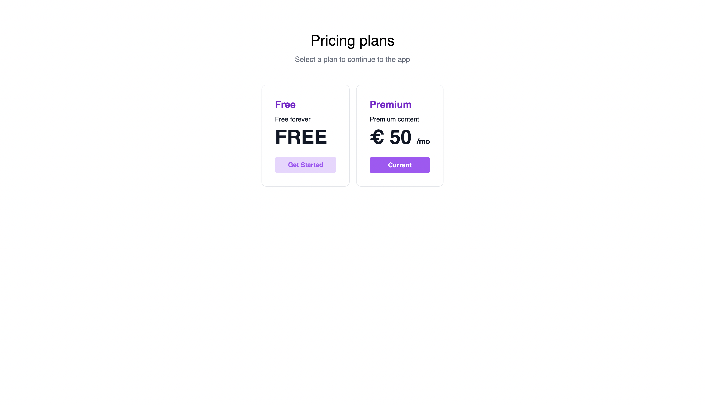
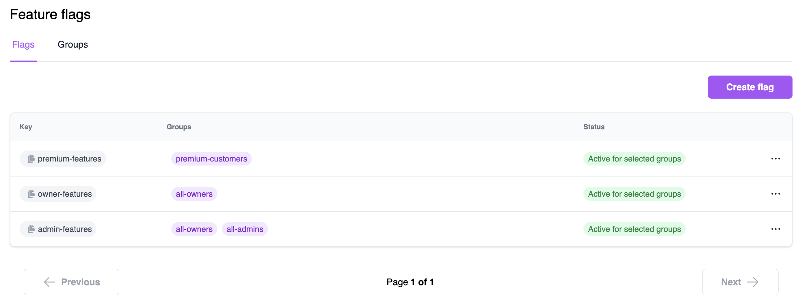

import Tabs from '@theme/Tabs';
import TabItem from '@theme/TabItem';
import PseudoCode from '../templates/_pseudo-code.mdx';

# Quickstart
On this page you will integrate your web application with Nblocks to get login, signup, plans and payments functionality for your users out of the box. We call this being user ready and you will accomplish this in no time. 
In each step you will apply a few lines of code to make redirects using the familiar OpenID Connect / OAuth 2.0 flows to obtain user tokens that will be used to protect your app and make use of our prebuilt fully flexible user portal.

## Two actions to handle

The integration essentially consists of two parts where the first part is where you redirect the user's browser to Nblocks and the second one is where the user is redirected back to your app with profile information.

This can be implemented for multiple use cases such as if you have:
- A frontend only
- A backend only
- A frontend and a backend in which case we recommend that you implement it in your backend.

After you're done with this part your application will have a login flow with sign in, sign up, and SSO.

The Nblocks team provides, maintains, and adds code examples for popular languages continuously. 
However, if you have a specific need not covered by this quickstart yet, you'll find documentation on how to use Nblocks with any language in our API reference [API reference](https://nebulr-group.github.io/nblocks-api-docs).


:::info Prerequisites

1. If you haven't already, [sign up](/docs/getting-started/signup) for Nblocks and get access to your [app id](/docs/getting-started/id-and-keys) 
1. An existing web application that can run on http://localhost:8080.

:::

<details><summary>Not using http://localhost:8080?</summary>

Nblocks is using sensible defaults to make development and integrations simpler. 
To use another application address you need to change your app profile configuration.

**Using [Nblocks Admin](https://admin.nblocks.cloud)**

The easiest way to do so is configuring your callback URLs in the [authentication settings](/docs/authentication-and-access/authentication-settings)

**Using the terminal tool**

**Step 1. Open `app-configuration.json`.**   
This json file was downloaded when you signed up for Nblocks through terminal.

**Step 2. Change the Oauth 2.0 callback uris.**   
In the json file, change the defaultCallbackUri and redirectUris to the correct address for your application.
```json
"defaultCallbackUri": "http://localhost:3000/auth/oauth-callback",
"redirectUris": [
	"http://localhost:3000/auth/oauth-callback"
],
```

**Step 3. Save the changes by pushing the updated configuration back to Nblocks**
```console
npx @nebulr-group/nblocks-cli push-app
```

</details>


## Step 1: Redirect users to Nblocks login

### Add a redirect action
Open your project source code in an editor of your choice. 
Then add an action in your app that will redirect the user to the Nblocks "Login" endpoint at `https://auth.nblocks.cloud/url/login/APP_ID` where `APP_ID` is your known app id.

A good practice is to add a new app route `/login` that triggers this action, so that when you navigate to `http://localhost:8080/login` the redirect is performed. Routing is a common concept and available for most frameworks.

#### Example code
<Tabs>
<TabItem value="reactjs" label="ReactJS" default>

Create a new component that we call `Login` and add this to the `/login` route. In React routes can be created with [react-router](https://reactrouter.com/) plugin.
```tsx
import { useEffect } from "react";

export default function Login() {

  // Replace this with your own APP ID
  // highlight-start
  const APP_ID = "XXX";
  // highlight-end

  // Immediately redirect the web browser to Nblocks login
  window.location.replace(`https://auth.nblocks.cloud/url/login/${APP_ID}`);
  return ("");
}
```

</TabItem>

<TabItem value="nextjs" label="NextJS" default>

Create a new file `/app/login/page.jsx` and call this component `Login`. This will add a new route to `/login` by the framework.

```tsx title=/app/login/page.jsx
import { redirect } from 'next/navigation'
 
export default function Login() {

  // Replace this with your own APP ID
  // highlight-start
  const APP_ID = "XXX";
  // highlight-end

  // Immediately redirect the web browser to Nblocks login
  redirect(`https://auth.nblocks.cloud/url/login/${APP_ID}`);
}
```
</TabItem>

<TabItem value="angular" label="Angular" default>

Create a new component that we call `Login` and add this to the `/login` route. In Angular routes can be created with the built in **RouterModule**.
```ts
@Component({
  template: '',
})
export class Login {
  constructor(
  ) {
    // Replace this with your own APP ID
    // highlight-start
    const APP_ID = "XXX";
    // highlight-end

    // Immediately redirect the web browser to Nblocks login
    window.location.replace(`https://auth.nblocks.cloud/url/login/${APP_ID}`);
  }
}
```

</TabItem>

<TabItem value="java" label="Java" default>

Create a new class that we call `LoginServlet` and add this to the `/login` route. In Java, routes can be created in a **Jetty** web server.

```java title=src/main/java/com/mycompany/app/LoginServlet.java
package com.mycompany.app;

import java.io.IOException;

import javax.servlet.ServletException;
import javax.servlet.http.HttpServlet;
import javax.servlet.http.HttpServletRequest;
import javax.servlet.http.HttpServletResponse;

class LoginServlet extends HttpServlet {
    // Replace this with your own APP ID
    // highlight-start
    private static final String APP_ID = "XXX";
    // highlight-end
    private static final String LOGIN_URL = "https://auth.nblocks.cloud/url/login/";

    @Override
    protected void doGet(HttpServletRequest request, HttpServletResponse response)
            throws ServletException, IOException {
        response.sendRedirect(LOGIN_URL + APP_ID);
    }
}
```

</TabItem>

<TabItem value="pseudo" label="Can't find your stack?" default>
  <PseudoCode/>
</TabItem>

</Tabs>

:::tip

Curious in what more ways you can use the  `/url/login` endpoint? See the [API reference](https://nebulr-group.github.io/nblocks-api-docs/#short-hand-authorize)

:::

## Step 2: Receive the user back to your app
When the user completes authentication with Nblocks Login, the user is redirected back to your app with a code token that we will resolve into something more useful.
The URL containing the code token will look like this: `http://localhost:8080/auth/oauth-callback?code=XXXXXX....`

### Add a callback route and use the code to exchange for user tokens
Add a new route `/auth/oauth-callback` in your app that will act as a handler when the user is returned. In this handler you should retrieve the code token from the URL mentioned above and save it.

Then we will exchange this code token for more useful user profile information. 
Your app should make an API call to the Nblocks "Token" endpoint at `https://auth.nblocks.cloud/token/code/APP_ID` where `APP_ID` is your known app id in order to make this exchange.
The returning response contains secure token data in JWT format that we'll verify cryptographically usign public keys.

:::tip Decoding and verifying JWTs

JWTs is a well known concept in security. That means there are plenty of libraries for many software stacks to decode and verify them into readable JSON. Here's a extensive [list](https://jwt.io/libraries) of different libraries.
We'll be using one of these in our code examples.
:::

#### Example code
<Tabs>
<TabItem value="reactjs" label="ReactJS" default>

Create a new component that we call `Callback` and add this to the `/auth/oauth-callback` route. In React routes can be created with [react-router](https://reactrouter.com/) plugin.

```jsx
import React, { useEffect, useState } from "react";
import { Navigate, useLocation } from 'react-router-dom';
import { jwtVerify, createRemoteJWKSet } from "jose";

// Users will get back to this component after finishing login
export default function Callback() {

  // Replace this with your own APP ID
  // highlight-start
  const APP_ID = "XXX";
  // highlight-end

  const location = useLocation();
  const [accessToken, setAccessToken] = useState();

  useEffect(() => {
    const code = new URLSearchParams(location.search).get("code");
    if (code) {
      handleCallback(code);
    }
  }, []);

  const handleCallback = async (code) => {
    // Get tokens
    const tokens = await fetch(`https://auth.nblocks.cloud/token/code/${APP_ID}`,
      {
        method: "POST", headers: { "Content-Type": "application/json", },
        body: JSON.stringify({ code }),
      }
    ).then(res => res.json());

    // Verify the tokens result using public keys from Nblocks JWKS
    const { access_token, refresh_token, id_token } = tokens;
    const { payload } = await jwtVerify(
      access_token, createRemoteJWKSet(
          new URL('https://auth.nblocks.cloud/.well-known/jwks.json')
      ), { issuer: 'https://auth.nblocks.cloud' }
    );

    // Store the result in component state and localstorage
    window.localStorage.setItem('access_token', access_token);
    window.localStorage.setItem('refresh_token', refresh_token);
    window.localStorage.setItem('id_token', id_token);
    setAccessToken(payload);
    console.log("User access token", payload);
  };

  if (accessToken)
      return (<Navigate to={"/"}/>);
  else
    return (<p>Not logged in</p>);
}
```

</TabItem>

<TabItem value="nextjs" label="NextJS" default>

Create a new file `/app/auth/oauth-callback/page.jsx` and call this component `Callback`. This will add a new route to `/auth/oauth-callback` by the framework.

```tsx title=/app/auth/oauth-callback/page.jsx
'use client'

import { useSearchParams, redirect } from "next/navigation";
import { useEffect, useState } from "react";
import { jwtVerify, createRemoteJWKSet } from "jose";

// Users will get back to this component after finishing login
export default function Callback() {

  // Replace this with your own APP ID
  // highlight-start
  const APP_ID = "XXX";
  // highlight-end

  const searchParams = useSearchParams();
  const [accessToken, setAccessToken] = useState();

  useEffect(() => {
    const code = searchParams.get('code');
    if (code) {
      handleCallback(code);
    }
  }, [searchParams]);

  const handleCallback = async (code) => {
    // Get tokens
    const tokens = await fetch(`https://auth.nblocks.cloud/token/code/${APP_ID}`,
      {
        method: "POST", headers: { "Content-Type": "application/json", },
        body: JSON.stringify({ code }),
      }
    ).then(res => res.json());

    // Verify the tokens result using public keys from Nblocks JWKS
    const { access_token, refresh_token, id_token } = tokens;
    const { payload } = await jwtVerify(
      access_token, createRemoteJWKSet(
          new URL('https://auth.nblocks.cloud/.well-known/jwks.json')
      ), { issuer: 'https://auth.nblocks.cloud' }
    );

    // Store the result in component state and localstorage
    window.localStorage.setItem('access_token', access_token);
    window.localStorage.setItem('refresh_token', refresh_token);
    window.localStorage.setItem('id_token', id_token);
    setAccessToken(payload);
    console.log("User access token", payload);
  };

  if (accessToken)
      redirect("/");
  else
    return (<p>Not logged in</p>);
}
```
</TabItem>

<TabItem value="angular" label="Angular" default>

Create a new component that we call `Callback` and add this to the `/auth/` route. In Angular routes can be created with the built in **RouterModule**.

```ts
import { jwtVerify, createRemoteJWKSet } from 'jose';
import { ActivatedRoute } from '@angular/router';
import { HttpClient } from '@angular/common/http';
import { Component } from '@angular/core';

@Component({
  template: '<div>Logging in...</div>',
})
export class Callback {
  // Replace this with your own APP ID
  // highlight-start
  const APP_ID = "XXX";
  // highlight-end

  private accessToken: any;

  constructor(private activatedRoute: ActivatedRoute, private http: HttpClient) {
    const code = this.activatedRoute.queryParams['code'];
    if (code) {
      this.handleCallback(this.activatedRoute.queryParams['code']);
    }
  }

  private handleCallback(code: string) {
    // Get tokens
    this.http
      .post(`https://auth.nblocks.cloud/token/code/${this.APP_ID}`, {
        code: code,
      })
      .subscribe(async (tokens: any) => {
        // Verify the tokens result using public keys from Nblocks JWKS
        const { access_token, refresh_token, id_token } = tokens;
        const { payload } = await jwtVerify(
          access_token,
          createRemoteJWKSet(
            new URL('https://auth.nblocks.cloud/.well-known/jwks.json')
          ),
          { issuer: 'https://auth.nblocks.cloud' }
        );

        // Store the result in component state and localstorage
        window.localStorage.setItem('access_token', access_token);
        window.localStorage.setItem('refresh_token', refresh_token);
        window.localStorage.setItem('id_token', id_token);
        this.accessToken = payload;
        console.log('User access token', payload);
      });
  }
}

```

</TabItem>

<TabItem value="java" label="Java">

Create a new class that we call `CallbackServlet` and add this to the `/auth/oauth-callback` route. In Java, routes can be created in a **Jetty** web server.

```java title=src/main/java/com/mycompany/app/CallbackServlet.java
package com.mycompany.app;

import java.io.IOException;
import java.net.URI;
import java.net.http.HttpClient;
import java.net.http.HttpRequest;
import java.net.http.HttpResponse;

import org.jose4j.jwt.consumer.InvalidJwtException;
import org.jose4j.jwt.consumer.JwtConsumer;
import org.jose4j.jwt.consumer.JwtConsumerBuilder;
import org.jose4j.keys.resolvers.HttpsJwksVerificationKeyResolver;
import org.json.JSONObject;
import org.jose4j.jwa.AlgorithmConstraints;
import org.jose4j.jwa.AlgorithmConstraints.ConstraintType;
import org.jose4j.jwk.HttpsJwks;
import org.jose4j.jws.AlgorithmIdentifiers;
import org.jose4j.jwt.JwtClaims;

import javax.servlet.ServletException;
import javax.servlet.http.HttpServlet;
import javax.servlet.http.HttpServletRequest;
import javax.servlet.http.HttpServletResponse;

public class CallbackServlet extends HttpServlet {

    // Replace this with your own APP ID
    // highlight-start
    private static final String APP_ID = "XXX";
    // highlight-end
    private static final String JWKS_URL = "https://auth.nblocks.cloud/.well-known/jwks.json";
    private static final String TOKEN_URL = "https://auth.nblocks.cloud/token/code/" + APP_ID;

    @Override
    protected void doGet(HttpServletRequest request, HttpServletResponse response)
            throws ServletException, IOException {
        String code = request.getParameter("code");

        JSONObject requestBody = new JSONObject().put("code", code);

        HttpRequest tokenRequest = HttpRequest.newBuilder()
                .uri(URI.create(TOKEN_URL))
                .header("Content-Type", "application/json")
                .POST(HttpRequest.BodyPublishers.ofString(requestBody.toString()))
                .build();

        HttpClient client = HttpClient.newHttpClient();

        try {
            // Get tokens
            HttpResponse<String> tokens = client.send(tokenRequest, HttpResponse.BodyHandlers.ofString());

            String responseBody = tokens.body();
            JSONObject responseJson = new JSONObject(responseBody);
            String accessToken = responseJson.getString("access_token");

            // Verify the tokens result using public keys from Nblocks JWKS
            HttpsJwks httpsJkws = new HttpsJwks(JWKS_URL);
            HttpsJwksVerificationKeyResolver httpsJwksKeyResolver = new HttpsJwksVerificationKeyResolver(httpsJkws);

            JwtConsumer jwtConsumer = new JwtConsumerBuilder()
                    .setVerificationKeyResolver(httpsJwksKeyResolver)
                    .setExpectedIssuer("https://auth.nblocks.cloud")
                    .setExpectedAudience(APP_ID)
                    .setJwsAlgorithmConstraints(new AlgorithmConstraints(ConstraintType.PERMIT,
                            AlgorithmIdentifiers.RSA_PSS_USING_SHA256))
                    .build();

            JwtClaims jwtClaims = jwtConsumer.processToClaims(accessToken);

            System.out.println("Token verified and processed: " + jwtClaims);

            // Return token to client
            response.setContentType("application/json");
            response.setCharacterEncoding("UTF-8");
            response.getWriter().write(accessToken);

        } catch (InterruptedException | InvalidJwtException e) {
            e.printStackTrace();
        }
    }
}
```

</TabItem>

<TabItem value="pseudo" label="Can't find your stack?" default>
  <PseudoCode/>
</TabItem>

</Tabs>

<details><summary>What is included in the tokens response?</summary>

**Tokens Response example**   
This is the anatomy of the tokens response.
```json
{
  "token_type": "Bearer", // Token type
  "expires_in": 3600, // How long the access token is valid (in seconds)
  "access_token": "eyJhbGciOiJQ...", // The access token
  "refresh_token": "eyJhbGciOiJQ...", // The refresh token used to generate new access tokens
  "id_token": "eyJhbGciOiJQ...", // The OpenID token (user profile)
}
```

</details>

:::tip

Curious in what more ways you can use the  `/token/code` endpoint? See the [API reference](https://nebulr-group.github.io/nblocks-api-docs/#shorthand-get-tokens)

:::

## Step 3: Test it

### 1. Start your app
Start your application so that it is accessible on [http://localhost:8080](http://localhost:8080)

### 2. Navigate to /login and get redirected to Nblocks Login
Open a browser tab and navigate to your apps' login url [http://localhost:8080/login](http://localhost:8080/login).

Your new code redirects the user to Nblocks Login.

### 3. Sign up as a new user and return back to your app
Click "Sign up"  button on the bottom of the login screen and you come to the signup screen.


Click to sign up with Google or Microsoft. If you don't have a Google or MS email you can sign up manually, the result will be the same.

Straight after sign up you will be presented with the payment screen that asks you to pick one of your app's plans.


After selecting a plan you get redirected back to your application again, to the callback route. 
The secure code gets exchanged to secure tokens and you're now authenticated. 
Open the console and you should see user profile information that we're printing from the component.

This user and the new workspace is now listed on the *Workspaces* page in [Nblocks Admin](https://admin.nblocks.cloud).

:::tip Didn't the callback work?

Make sure your application is running on port 8080. That is the most common mistake.
If not, check the prerequisites section again to learn how to use another port than 8080.

:::

## Step 4: Exploring the dashboard in Nblocks Admin
Congratulations! You’ve successfully integrated Nblocks into your app, enabling seamless user authentication and plan selection. Now, let’s dive into the dashboard, where you can further customize and manage your application’s features.

### Admin Overview:
- **Alternative Authentication Methods:** Choose from a variety of authentication options, including social logins and two-factor authentication, to enhance security and user convenience.
- **Payment Method Setup:** Easily integrate your preferred payment methods to streamline the billing process.
- **User Role Management:** Define and manage user roles, tailoring access and permissions to fit your application’s needs.
- **Branding Customization:** Adjust the look and feel of your login and signup flows from the Branding tab to align with your app’s aesthetic.


### Feature Flags:
One of the most powerful tools in your arsenal, feature flags, allows you to control feature access based on payment plans, user roles, or even specific users or workspaces. 
Learn how to get started with feature flags [here](/docs/feature-flags/quickstart-feature-flags).



### Workspace and User Management:
Get a comprehensive view of all Workspaces and the users within each, enabling efficient management and oversight.

## Next Steps:
- Explore each section of the dashboard to familiarize yourself with its capabilities.
- Experiment with different settings to find what works best for your application.

If you need help or have questions, connect to us via our [support](mailto:support@nblocks.dev) and [community forum](https://discord.gg/kjWYdZ6f6G).

We’re excited to see how you leverage Nblocks to enhance your application. If you have any feedback or suggestions, please let us know!

That concludes this quickstart. You have just added all these capabilities with only two app routes and you signed up as a new user.

## Related articles
* Add [feature flags](/docs/feature-flags/quickstart-feature-flags) to conditionally show and hide content to your users.
* Fine tune how users can login and sign up via [authentication settings](/docs/authentication-and-access/authentication-settings).
* See best practices on how to use tokens to protect your [frontend](/docs/authentication-and-access/protect-frontend) or [backend](/docs/authentication-and-access/protect-backend).
* Customize the appearance with [branding](/docs/branding/quickstart-branding).