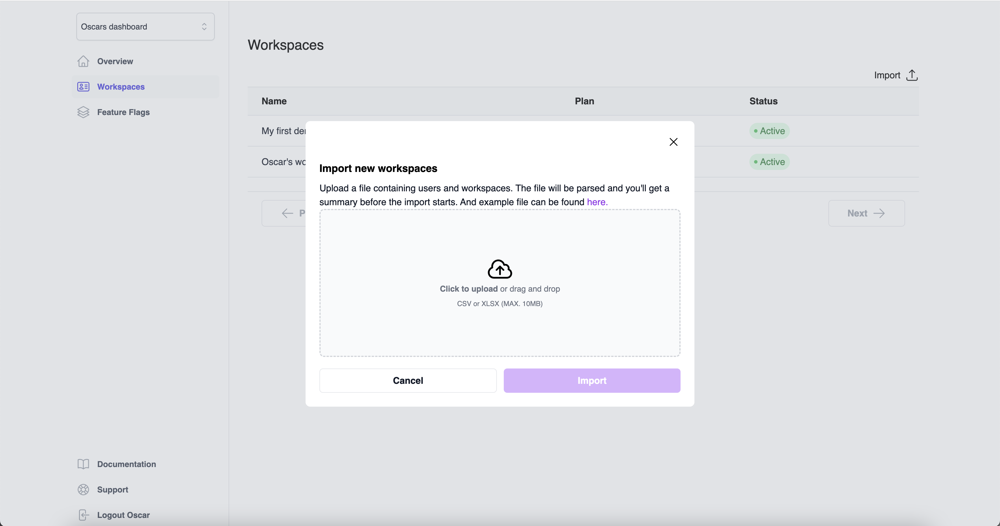
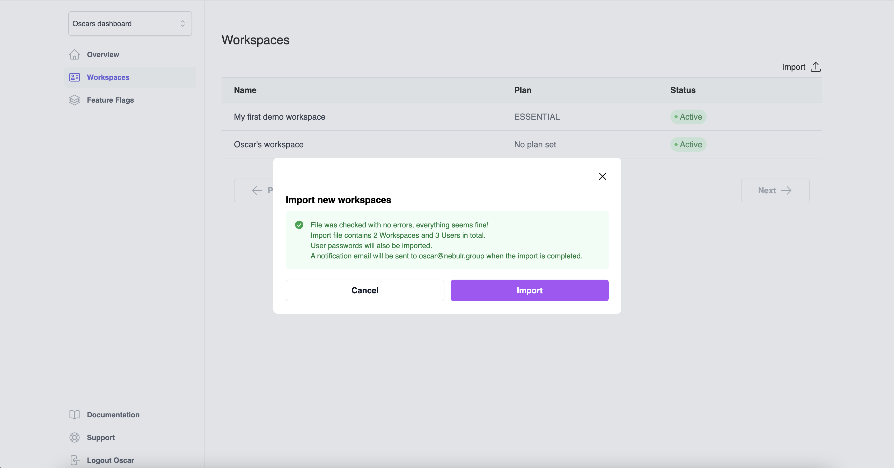

# Switching to Nblocks
Switching to Nblocks is really easy, both if you plan to use standalone features or use Nblocks to login users. 
If you have existing users you can import them into Nblocks with or without existing credentials. 

You can do imports in Nblocks Admin as well as Nblocks Rest API.

## Importing tenants via Nblocks Admin
1. Go to [Nblocks Admin](https://admin.nblocks.cloud) and login.

2. Click the Workspaces tab.

3. Click the import button.

4. Upload a CSV or XLXS file containing your existing users and tenants. An example file is available to download as reference.

5. Once uploaded, Nblocks is going to validate the file and give you a summary about what information is about to be imported.

6. Click Import. The import will start and you'll get an email when the process has been completed.

## Importing tenants via Rest API
How to import tenants via Rest API is described [here](https://nebulr-group.github.io/nblocks-api-docs/#import-data)