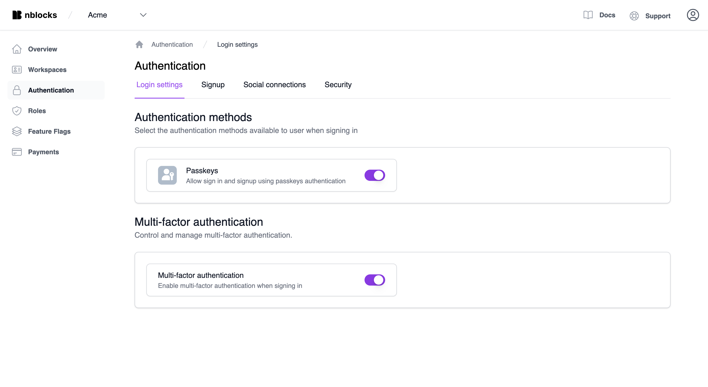
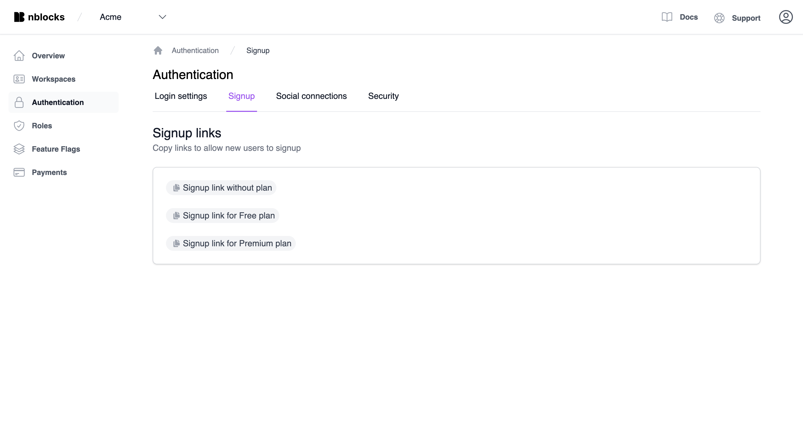
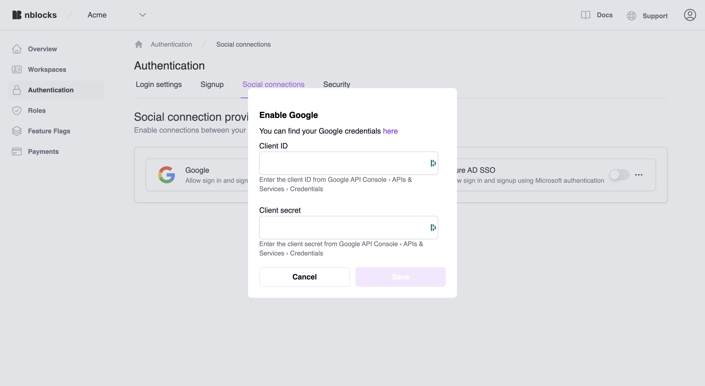
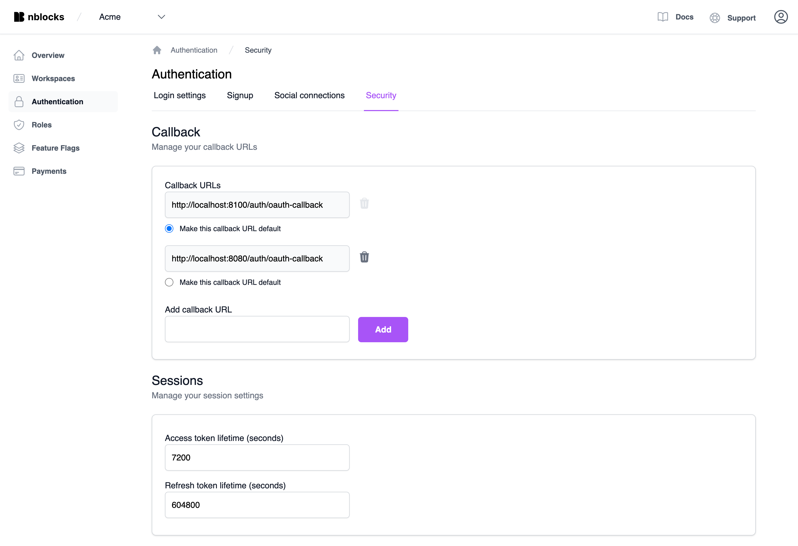

# Authentication Settings

Within [Nblocks Admin](https://admin.nblocks.cloud), you can tailor authentication settings for your application. This includes options for multi-factor authentication (MFA), social login providers, and the duration of token sessions.

## Login Settings

### Authentication Methods

#### Passkeys

Toggle this setting to either permit or prohibit users from signing in with passkeys. Deactivating this feature will remove the passkey sign-in option from the login page.

#### Multi-Factor Authentication (MFA)

Enable or disable MFA for your application's users. When MFA is activated, tenant owners have the option to enforce MFA for all users within their tenant. A user will be required to use MFA if they are part of any tenant that mandates it.

:::info Disabling MFA

Deactivating MFA will turn it off for all users, regardless of individual tenant settings. Tenant owners will lose the ability to set their own MFA configurations.

:::

Turning MFA on or off will not alter existing tenant-specific settings. Re-enabling MFA will retain any previously configured tenant rules.

## Signup

Access signup links quickly for the various plans you've set up in the [payments section](/docs/payments/payments-portal#create-plans-in-nblocks-admin).

## Social Connections

Specify which social login providers you wish to enable for your users. Upon activating a provider for the first time, Nblocks will request the necessary credentials. Once stored, you can toggle the login method on or off without affecting the saved credentials, which can be updated or removed separately. Toggling on or off a provider will show or hide it as a sign-in option on the login page. Current supported providers include *Google* and *Azure AD SSO*.

## Enterprise Connections

How to setup Enterprise Connections are described in [Enterprise login](/docs/authentication-and-access/enterprise-login)

## Security

### Callback

Designate an approved list of callback URLs that Nblocks can use to redirect your users. These URLs should point to your trusted applications. The default URL is where Nblocks will redirect users after they've completed authentication via Nblocks' Login, as configured in the [quickstart](/docs/getting-started/quickstart#step-2-receive-the-user-back-to-your-app). For finer control, in line with OAuth2 specifications, refer to our [API documentation](https://nebulr-group.github.io/nblocks-api-docs/#authorize).

### Sessions

Set the lifespan of your tokens, measured in seconds. The access token's lifespan dictates how frequently your app needs to request a new token using the refresh token. The refresh token's lifespan sets the duration a user can access your app without needing to log in again.