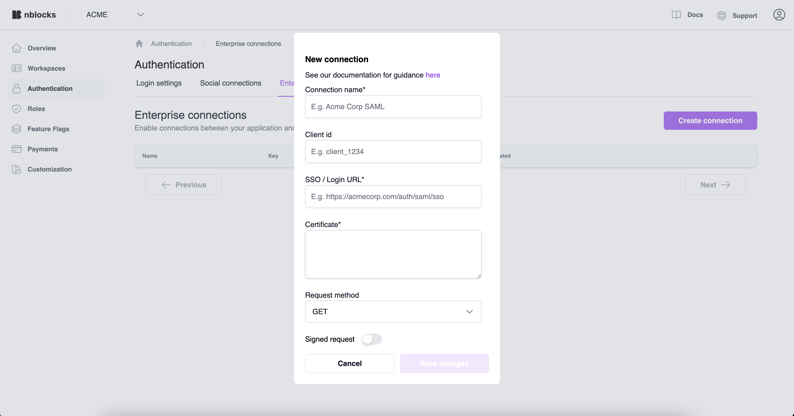
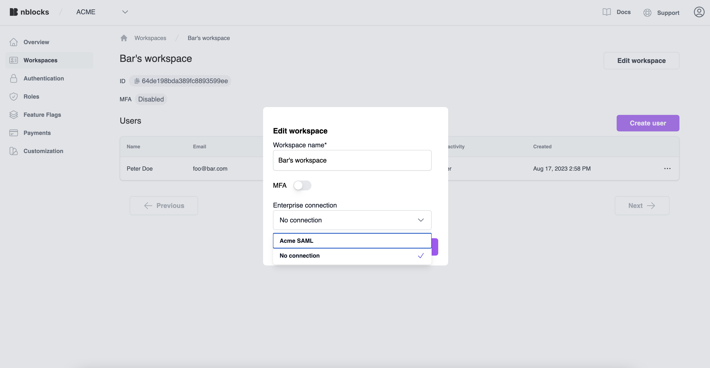

import Tabs from '@theme/Tabs';
import TabItem from '@theme/TabItem';

# Enterprise login

In this guide, we'll walk you through the process of setting up Enterprise Login with Security Assertion Markup Language (SAML) in Nblocks.
This powerful feature allows you to seamlessly integrate your application with various Identity Providers (IdPs) supporting SAML.

## Why Enterprise Login Matters
If your app needs to scale for enterprise users. Security is non-negotiable, and centralized user management is a must, Enterprise login becomes a requirement.
IT admins and managers can control who gets access to your app directly from their identity management system. 

## Prerequisites
Before setting up the SAML connection, make sure you have the following information from your Identity Provider (IdP):

- **SSO / Login URL**: The URL where the IdP expects to receive SAML authentication requests.
- **Certificate**: The public key certificate provided by the IdP to validate the SAML responses.
- **Client ID**: The identifier assigned to your application by the IdP. This is sometimes not required.
- **Request Method**: The preferred method for sending SAML requests, either HTTP GET Redirect (most common) or HTTP POST.
- **Signed Request**: Determine whether the IdP requires the SAML request to be signed or not.

:::tip Test with a mock IdP

There are several mock SAML IdPs avaible to test with, like [Mock SAML](https://mocksaml.com/).
You can use this to setup a new Enterprise Connection in Nblocks.
:::

## Creating a new connection

1. Log in to [Nblocks Admin](https://admin.nblocks.cloud).
1. Click Enterprise Login.
1. Click Create connection.
1. Give your new connection a name. This will also be visible for users when logging in.
1. Enter Client id, if the IdP have assigned you one.
1. Enter the SSO Url from the IdP.
1. Enter the certificate from the IdP.
1. Enter the preferred request method. Defaults to GET.
1. If the IdP requires the request to be signed
    1. Choose a signing algorithm. Defaults to SHA-256.
    1. Generate a public and private key in PEM format and give the public key to the IdP.
    1. Enter the private key.
1. Click save.

Your connection is now ready to be used. Before we can test it we need to assign it to a tenant. Users of that tenant will be able to authenticate with this connection.

## Assigning a connection to a tenant

1. Log in to [Nblocks Admin](https://admin.nblocks.cloud).
1. Click Workspaces.
1. Click the workspace you wish to assign to, or create a new one.
1. Click edit workspace.
1. Under Enterprise connection, select the new connection.
1. Click save.

That's it 🎉 The SAML connection is now the preferred login method for this tenant and you you can test this by logging in as one of the users.

:::note Security information

Users of tenants with enterprise login will only be able to login this way. That's because the IdP now manage the application access.

:::