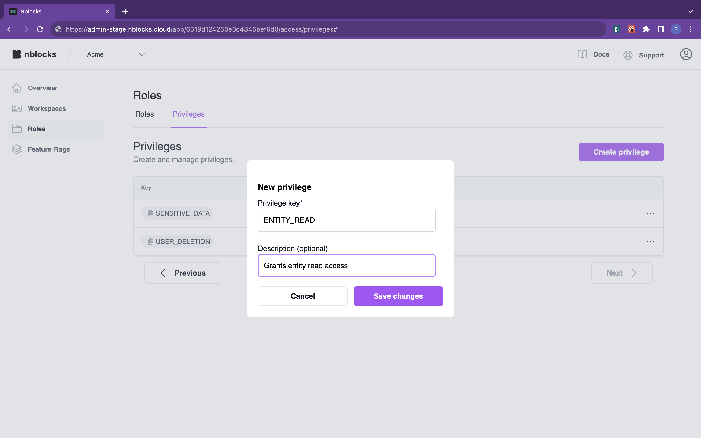
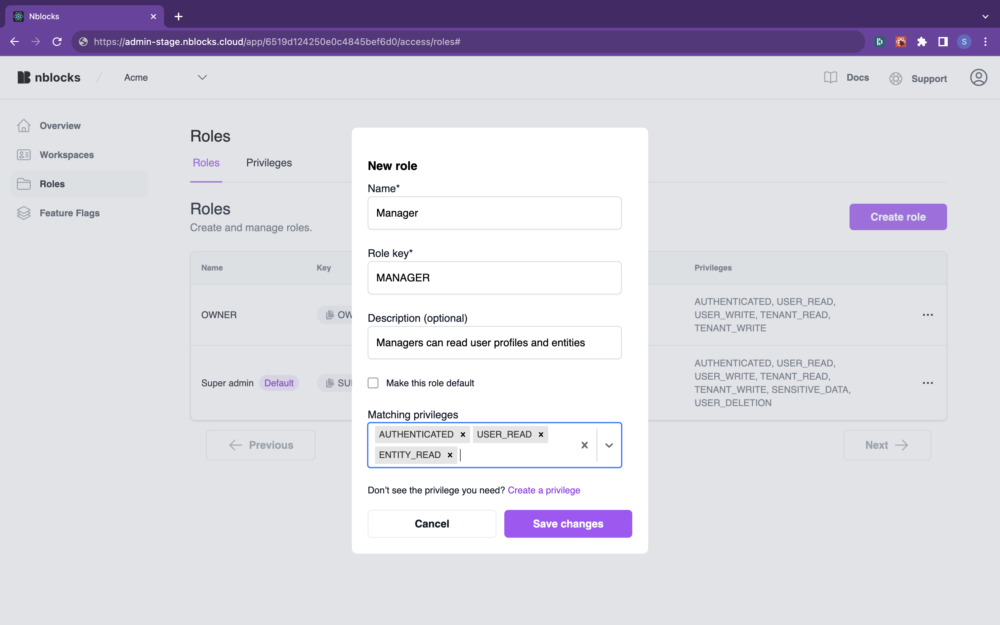

# Roles & Privileges

In Nblocks, each user is assigned a role that grants them specific privileges. Roles act as groups for these privileges, enabling fine-grained control over what each user can see and do within your application. This setup is key to crafting a secure and robust system. While the `OWNER` role and `AUTHENTICATED` privilege are mandatory and cannot be changed, you have full flexibility to define additional roles and privileges based on your needs.

**Good examples of roles**: `ADMIN`, `MANAGER`, `GUEST`, etc.  
**Good examples of privileges**: `USER_READ`, `USER_WRITE`, `ENTITY_READ`, etc.

:::note

Nblocks automatically assigns the `OWNER` role to the person who initiates the creation of a new workspace. This person becomes the first user and responsible owner of that workspace.

:::

## Define your roles

In [Nblocks Admin](https://admin-stage.nblocks.cloud), begin by creating a privilege and adding an optional description:  


Then, associate that privilege, along with others, to a new role:  


## Implement authorization

After [protecting your app](./quickstart-user-ready#protect-your-app), your newly defined roles will become available for granting user access, as reflected in the updated [access token](./quickstart-user-ready#short-info-about-the-access-token):

```json
{
  "aid": "63d2ab029e23db0afb07a5a7",
  "tid": "63d2b5c18892e10022e08399",
  // highlight-start
  "scope": "AUTHENTICATED USER_READ ENTITY_READ",
  "role": "MANAGER",
  // highlight-end
  "plan": "FREE",
  "iat": 1685648418,
  "exp": 1685652018,
  "aud": ["63d2ab029e23db0afb07a5a7", "https://app-stage.nblocks.cloud"],
  "iss": "https://auth-stage.nblocks.cloud",
  "sub": "63d2b5c18892e10022e083a2"
}
```
