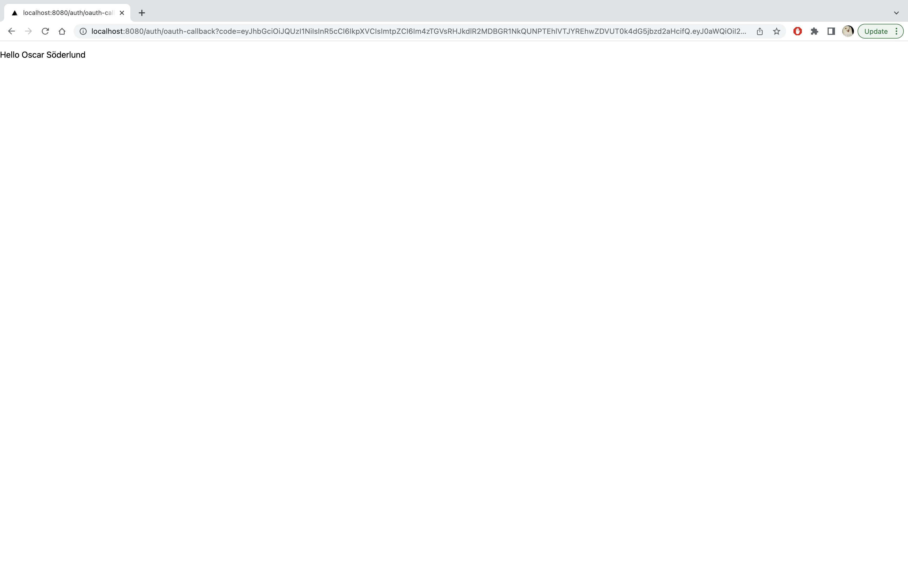

import Tabs from '@theme/Tabs';
import TabItem from '@theme/TabItem';

# Quickstart User Login
On this page you will integrate your web application with Nblocks hosted login and have your users authenticate in no time. You will apply a few lines of code to make redirects using the familiar OpenId Connect and OAuth 2.0 flows.
The integration essentially consists of two parts where the first part is where you redirect the user's browser to Nblocks and the second one is where the user is redirected back to your app with profile information.

This can be implemented in your frontend or backend according to your use case. After you're done with this guide your application will have a login flow with sign in, sign up, and SSO. 

The Nblocks team provides, maintains, and adds code examples for popular languages continuously. 
However, if you have a specific need not covered by this quickstart yet, you'll find documentation on how to use Nblocks with any language in our API reference [API reference](https://nebulr-group.github.io/nblocks-api-docs).


:::info Prerequisites

1. If you haven't already, [sign up](/docs/getting-started/signup) for Nblocks and get access to your [app id](/docs/getting-started/id-and-keys) 
1. An existing web application that can run on http://localhost:8080.

:::

<details><summary>Not using http://localhost:8080?</summary>

Nblocks is using sensible defaults to make development and integrations simpler. 
To use another application address you need to change your app profile configuration.

**Step 1. Open `app-configuration.json`.**   
This json file was downloaded when you signed up for Nblocks through terminal.

**Step 2. Change the Oauth 2.0 callback uris.**   
In the json file, change the defaultCallbackUri and redirectUris to the correct address for your application.
```json
"defaultCallbackUri": "http://localhost:3000/auth/oauth-callback",
"redirectUris": [
	"http://localhost:3000/auth/oauth-callback"
],
```

**Step 3. Save the changes by pushing the updated configuration back to Nblocks**
```console
npx @nebulr-group/nblocks-cli push-app
```

</details>

:::tip Code examples

You can view example projects using the code from this guide [here](/docs/getting-started/example-projects).

:::


## Step 1: Redirect users to Nblocks login

### Add a redirect action
Open your project source code in an editor of your choice. 
Then add an action in your app that will redirect the user to the Nblocks "Login" endpoint at `https://auth-stage.nblocks.cloud/url/login/APP_ID` where `APP_ID` is your known app id.

A good practice is to add a new app route `/login` that triggers this action, so that when you navigate to `http://localhost:8080/login` the redirect is performed.


#### Example code
<Tabs>
<TabItem value="reactjs" label="ReactJS" default>

Create a new component that we call LoginComponent.
```ts
export default function LoginComponent() {

  const APP_ID = "XXX";
  useEffect(() => {
    // Immediately redirect the web browser to Nblocks login
    window.location.replace(`https://auth-stage.nblocks.cloud/url/login/${APP_ID}`);
  })

  return ("");
}


```

Adding a new route that renders the LoginComponent can be done with `react-router` plugin.
```ts
<Routes>
  <Route path="/login" element={<LoginComponent />}></Route>
</Routes>
```

</TabItem>

<TabItem value="angular" label="Angular" default>

Create a new component that we call LoginComponent.
```ts
@Component({
  template: '',
})
export class LoginComponent {
  constructor(
  ) {
    const APP_ID = "XXX";
    window.location.replace(`https://auth-stage.nblocks.cloud/url/login/${APP_ID}`);
  }
}

```

</TabItem>

<TabItem value="pseudo" label="Can't find your stack?" default>

If you cannot find your stack in the example code you need to integrate this part manually.

Essentially you should redirect the user to the url described in the [API reference](https://nebulr-group.github.io/nblocks-api-docs/#short-hand-authorize) for the `/url/login` endpoint.

Don't forget to make a request and we'll be happy to add this stack as an example.
</TabItem>

</Tabs>

:::tip

Curious in what more ways you can use the  `/url/login` endpoint? See the [API reference](https://nebulr-group.github.io/nblocks-api-docs/#short-hand-authorize)

:::

## Step 2: Recieve the user back to your app
When the user completes authentication with Nblocks Login, the user is redirected back to your app with a code that we will resolve into something more useful.
The URL containing the code parameter will look like this: `http://localhost:8080/auth/oauth-callback?code=XXXXXX....`

### Add a callback route
Add a new route `/auth/oauth-callback` in your app that will act as a handler when the user is returned. In this handler you should add source code that retrieves the code parameter from the URL mentioned above and save it.

#### Example code
<Tabs>
<TabItem value="reactjs" label="ReactJS" default>

Create a new component that we call CallbackComponent.

```ts
// Users will get back to this component after finishing login
export default function CallbackComponent() {

  const location = useLocation();
  const urlSearch = new URLSearchParams(location.search);
  const code = urlSearch.get("code");

  useEffect(() => {
    if (code) {
      handleCallback(code);
    }
  }, [code]);

  const handleCallback = async (code) => {
    // Here we'll be using the code in next step  
  };

  return (<p>Not logged in</p>);
}
```

Adding a new route that renders the CallbackComponent can be done with `react-router` plugin.
```ts
<Routes>
  <Route path="/auth/oauth-callback" element={<CallbackComponent />}></Route>
</Routes>
```

</TabItem>

<TabItem value="angular" label="Angular" default>

Create a new component that we call CallbackComponent.

```ts
// Users will get back to this component after finishing login
@Component({
  template: '<p>Not logged in</p>',
})
export class CallbackComponent {
  constructor(
    private route: ActivatedRoute,
  ) {
    combineLatest([
      this.route.queryParams
    ]).pipe(
      takeUntilDestroyed(),
    ).subscribe(([queryParams]) =>
      this.handleCallback(queryParams['code'])
    );
  }

  handleCallback(code: string) {
    // Here we'll be using the code in next step 
  }
}

```

</TabItem>

<TabItem value="pseudo" label="Can't find your stack?" default>

If you cannot find your stack in the example code you need to integrate this part manually.

You should implement the nessesary steps to get hold of the `code` parameter in the URL. This code should be saved into a variable before moving to next step.

Don't forget to make a request and we'll be happy to add this stack as an example.
</TabItem>

</Tabs>

### Use the code to exchange for user tokens
With the code now successfully obtained we can exchange it for more useful user profile information. 
Your app should make an API call to the Nblocks "Token" endpoint at `https://auth-stage.nblocks.cloud/token/code/APP_ID` where `APP_ID` is your known app id in order to make this exchange.
The returning response contains secure token data and a resolved user profile which you can print to the console or display on your frontend page.

#### Example code
<Tabs>
<TabItem value="reactjs" label="ReactJS" default>

Here we evolve on the CallbackComponent we created in the step before. The new additions has been highlighted.

```ts
// Users will get back to this component after finishing login
export default function CallbackComponent() {

  const location = useLocation();
  const urlSearch = new URLSearchParams(location.search);
  const code = urlSearch.get("code");

  // highlight-start
  const APP_ID = "XXX";
  const [tokens, setTokens] = useState();
  // highlight-end

  useEffect(() => {
    if (code) {
      handleCallback(code);
    }
  }, [code]);

  const handleCallback = async (code) => {
    // highlight-start
    // Make the API call to Nblocks
    const result = await fetch(`https://auth-stage.nblocks.cloud/token/code/${APP_ID}`,
      {
        method: "POST",
        headers: {
          "Content-Type": "application/json",
        },
        body: JSON.stringify({
          code: code,
        }),
      }
    ).then(res => res.json());

    // Store the result in component state
    setTokens(result);
  };

  if (tokens)
    return (<p>Hello {tokens.user_profile.name}</p>);
  else
    return (<p>Not logged in</p>);
  // highlight-end
}
```

</TabItem>

<TabItem value="angular" label="Angular" default>

Here we evolve on the CallbackComponent we created in the step before. The new additions has been highlighted.

```ts

// highlight-start
@Component({
  template: '<div><p *ngIf="!tokens">Not logged in</p><p *ngIf="tokens">Hello {{tokens.user_profile.name}}</p></div>',
})
// highlight-end
export class CallbackComponent {

  // highlight-start
  private tokens: any;
  private APP_ID = "XXX";
  // highlight-end

  constructor(
    private route: ActivatedRoute,
    // highlight-start
    private http: HttpClient,
    // highlight-end
  ) {
    combineLatest([
      this.route.queryParams
    ]).pipe(
      takeUntilDestroyed(),
    ).subscribe(([queryParams]) =>
      this.handleCallback(queryParams['code'])
    );
  }

  handleCallback(code: string) {
    // highlight-start
    // Make the API call to Nblocks
    this.http.post(`https://auth-stage.nblocks.cloud/token/code/${this.APP_ID}`, {
      code: code
    }).pipe(
      take(1),
    ).subscribe((response) => {
      // Store the result in component state
      this.tokens = response;
    });
    // highlight-end
  }
}

```

</TabItem>

<TabItem value="pseudo" label="Can't find your stack?" default>

If you cannot find your stack in the example code you need to integrate this part manually.

Essentially you should make a call to the `/token/code` endpoint described in the [API reference](https://nebulr-group.github.io/nblocks-api-docs/#shorthand-get-tokens).

Don't forget to make a request and we'll be happy to add this stack as an example.
</TabItem>

</Tabs>

**Token Response example**   
This is shows the structure of the token response.
```json
{
  "token_type": "Bearer",
  "expires_in": 3600,
  "access_token": "eyJhbGciOiJQ...",
  "refresh_token": "eyJhbGciOiJQ...",
  "id_token": "eyJhbGciOiJQ...",
  "user_profile": {
    "name": "John Doe",
    "family_name": "Doe",
    "given_name": "John",
    ...
  }
}
```

:::tip

Curious in what more ways you can use the  `/token/code` endpoint? See the [API reference](https://nebulr-group.github.io/nblocks-api-docs/#shorthand-get-tokens)

:::

## Step 4: Test it

### 1. Start your app
Start your application so that it is accessible on [http://localhost:8080](http://localhost:8080)

### 2. Navigate to /login and get redirected to Nblocks Login
Navigate to [http://localhost:8080/login](http://localhost:8080/login)

### 3. Create a new account

Since you don't have a previous user account click "**Create one**".
You can signup with your email or use Google or Microsoft SSO for a faster process.


Here we have clicked to signup with Google. The Google login screen is shown.

### 4. Get redirected back to your app as a logged in user
After logging in, you get redirected back to your application again.

Observe that we now see the user information beeing printed out in the console.
## Next steps

- Protect your frontend and backend with user tokens.
- Add Nblocks hosted user management to your app.
- Add SSO alternatives to your login experience.
