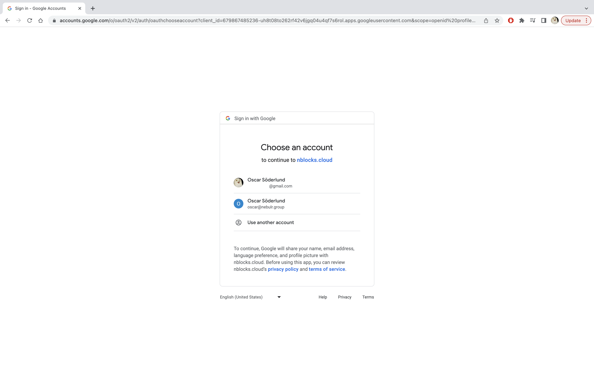

import Tabs from '@theme/Tabs';
import TabItem from '@theme/TabItem';

# Quickstart User Login
On this page you will integrate your web application with Nblocks hosted login and have your users authenticate in no time. You can do this in your frontend or backend which can be in any stack or framework. 
You will apply a few lines of code to make redirects using the familiar OpenId Connect and OAuth 2.0 flows.

After you're done with this guide your application will have a login flow with sign in, sign up, and SSO. 

:::info Prerequisites

1. If you haven't already, [sign up](/docs/getting-started/signup) for Nblocks and get access to your [app id](/docs/getting-started/id-and-keys) 
1. An existing web application that can run on http://localhost:8080.

:::

<details><summary>Not using http://localhost:8080?</summary>

Nblocks is using sensible defaults to make development and integrations simpler. 
To use another application address you need to change your app profile configuration.

**Step 1. Open `app-configuration.json`.**   
This json file was downloaded when you signed up for Nblocks through terminal.

**Step 2. Change the Oauth 2.0 callback uris.**   
In the json file, change the defaultCallbackUri and redirectUris to the correct address for your application.
```json
"defaultCallbackUri": "http://localhost:3000/auth/oauth-callback",
"redirectUris": [
	"http://localhost:3000/auth/oauth-callback"
],
```

**Step 3. Save the changes by pushing the updated configuration back to Nblocks**
```console
npx @nebulr-group/nblocks-cli push-app
```

</details>

:::tip Code examples

You can view example projects using the code from this guide [here](/docs/getting-started/example-projects).

:::


## Step 1: Redirect users to Nblocks login

### Add a redirect action
Open your project source code in an editor of your choice. 
Then add an action in your app that will redirect the user to the Nblocks Login entrypoint at `https://auth-stage.nblocks.cloud/url/login/APP_ID` where `APP_ID` is your known app id.
Preferrably you can add this action to the route `/login`, so that when you access `http://localhost:8080/login` the redirect is triggered.


Below are pseudocode depending if you're implementing this for a frontend or backend.

#### Pseudocode
<Tabs>
<TabItem value="frontend" label="Frontend" default>

```ts
var APP_ID = "XXX";
// Immediately redirect the web browser to Nblocks login
window.location.href = `https://auth-stage.nblocks.cloud/url/login/${APP_ID}`;

```

</TabItem>

<TabItem value="backend" label="Backend" default>

```ts
var APP_ID = "XXX";
// Create an api endpoint "/login"
router.get("/login", (req, res) => {
    // Redirect the web browser to Nblocks login
    res.redirect(`https://auth-stage.nblocks.cloud/url/login/${APP_ID}`)
})
```

</TabItem>
</Tabs>

:::tip

Here we're using the `/authorize` endpoint. For more details see the [API reference](https://nebulr-group.github.io/nblocks-api-docs/#short-hand-authorize)

:::

## Step 2: Recieve the user back to your app
When the user completes authentication with Nblocks Login, the user is redirected back to your app with a code that we will resolve into something more useful.
The URL containing the code parameter will look like this: `http://localhost:8080/auth/oauth-callback?code=XXXXXX....`

### Add a callback route
Add a new route `/auth/oauth-callback` in your app that will act as a handler when the user is returned. In this handler you should add source code that retrieves the code parameter from the URL mentioned above and save it.

Below are pseudocode depending if you're implementing this for a frontend or backend.
#### Pseudocode
<Tabs>
<TabItem value="frontend" label="Frontend" default>

```ts
// Grab the code parameter from current URL
var code = (new URL(window.location.href)).searchParams.get('code');
```

</TabItem>

<TabItem value="backend" label="Backend" default>

```ts
// Create an api endpoint "/auth/oauth-callback"
router.get("/auth/oauth-callback", (req, res) => {
    // Grab the code query parameter from the request
    var code = req.query.code;
})
```

</TabItem>
</Tabs>

### Use the code to exchange for user tokens
With the code now successfully obtained we can exchange it for more useful user profile information. 
Your app should make an API call in order to make this exchange. 
The returning response contains secure token data and a resolved user profile which you can print to the console or display on your frontend page.

<Tabs>
<TabItem value="rest" label="Rest" default>

**Request**
```ts
POST https://auth-stage.nblocks.cloud/token/code/APP_ID
```

**Response**
```json
{
  "token_type": "Bearer",
  "expires_in": 3600,
  "access_token": "eyJhbGciOiJQ...",
  "refresh_token": "eyJhbGciOiJQ...",
  "id_token": "eyJhbGciOiJQ...",
  "user_profile": {
    "name": "John Doe",
    "family_name": "Doe",
    "given_name": "John",
    ...
  }
}
```

</TabItem>

<TabItem value="js" label="JS" default>

```ts
const APP_ID = "XXXX";
const code = "XXXX"; // This is the code you just obtained

// Make the API call to Nblocks
const result = await fetch(`https://auth-stage.nblocks.cloud/token/code/${APP_ID}`,
  {
    method: "POST",
    headers: {
      "Content-Type": "application/json",
    },
    body: JSON.stringify({
      code: code,
    }),
  }
).then(res => res.json());

// Print the user info to console
console.log(result.user_profile);
```

</TabItem>

</Tabs>

:::tip

Here we're using the `/token` endpoint. For more details see the [API reference](https://nebulr-group.github.io/nblocks-api-docs/#shorthand-get-tokens)

:::

## Step 4: Test it

### 1. Start your app
Start your application so that it is accessible on [http://localhost:8080](http://localhost:8080)

### 2. Navigate to /login
Navigate to [http://localhost:8080/login](http://localhost:8080/login)

### 3. Get redirected to Nblocks Login

This is Nblocks Login. Since you don't have a previous user account click "**Create one**".
You can signup with your email or use Google or Microsoft SSO for a faster process.



Here we have clicked to signup with Google. The Google login screen is shown.

### 4. Get redirected back to your app as a logged in user
After logging in, you get redirected back to your application again.

Observe that we now see the user information beeing printed out in the console.
## Next steps

- Add SSO alternatives to your login experience.
- Understand the mechanics of user tokens and how you can trust them in your app.
- Protect your frontend and backend with user tokens.
- Add Nblocks hosted user management to your app.
- Go through the checklist before going live.
