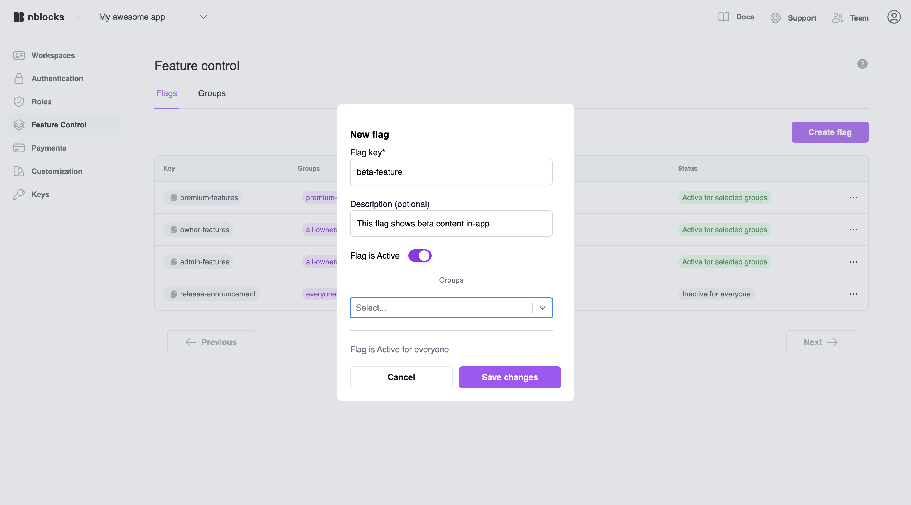

import Tabs from '@theme/Tabs';
import TabItem from '@theme/TabItem';

# Using Feature Flags Standalone
On this page you will learn how to integrate your web application with Nblocks Feature Flags and use it standalone without other Nblocks features. 
This allows you to conditionally give access to or show / hide features or content to your users.

Some use cases for feature flags are: 
* Restrict access to premium content that just users with a certain plan can access
* Try beta features on a selection of customers
* Show a message to all users during a scheduled release.
* Protect a feature with Role based access controll (RBAC).

**The content of this tutorial**
1. First we'll go through how you will apply a few lines of code to conditionally show content in your app.
1. Then we'll create the flags for the features in Nblocks Admin with conditions that should apply to it.

:::info Prerequisites

1. If you haven't already, [sign up](/docs/getting-started/signup) for Nblocks and get access to your [app id](/docs/getting-started/id-and-keys)

:::

## What is Standalone?
Everything within Nblocks can cherrypicked and used as standalone features. 
This guide shows you how you can integrate Feature flags into your project without using authentication or user management from Nblocks.

Use this as a way to tap into what Nblocks has to offer without going the whole route. But remember, it is when you use the features together the magic happens! 🚀

:::tip

If you have Nblocks manage your users, checkout the more simple approach using the magic of access tokens in [Feature flags Quickstart](/docs/feature-flags/quickstart-feature-flags)

:::

## Integrating in your code

The integration essentially consists of requesting an evaluation of a flag by providing user context information and then handling the evaluation response.

The evaluation endpoint URL consists of your app id and the flag key you wish to evaluate.

The url can look like this: https://backendless.nblocks.cloud/flags/evaluate/APP_ID/FLAG_KEY

And the response looks like this:
```json
{
    "enabled": true
}
```

### Adding user context information
Adding user context information to your evaluation request enable you to build conditions for what and whom flags should be enabled for in Nblocks Admin.
We've simplified this by defining a base structure, the context object, of what information you can and should send.

We recommend you to send as much information as possible from start for a flexible experience without the need for re-releases while you add more flags and conditions. 

The context object contains three areas, `user`, `org` and `device`. Each one of them reflect different traits and holds predefined relevant properties that you can assign.
Here's an example:

```json
{
    user: {
        id: "john@doe.com",
        role: "ADMIN",
        name: "John Doe",
        key: "custom-user-trait"
    }

    org: {
        id: "66238feb99227400774266f5",
        plan: "PREMIUM",
        name: "My Workspace",
        key: "custom-customer-trait",
    }

    device: {
        key: "iphone"
    }
}
```

Now, let's integrate this into our app!

##### Example code
<Tabs>

<TabItem value="reactjs" label="ReactJS" default>

1. Install the Nblocks react plugin

```bash
npx @nebulr-group/nblocks-cli setup-react
```

2. Add the NblocksProvider

Add the `NblocksProvider` to your top most component, e.g. the App component and wrap the rest of your app as children.

```tsx
import { NblocksProvider } from '@nebulr-group/nblocks-react';

export default function App() {
  return (
    <NblocksProvider config={{ appId: 'XXX'  /* Replace this with your own APP ID */ }}>
      ... App components ...
    </NblocksProvider>
  );
}
```

3. Use the FeatureFlag Component

Imagine you have a component that looks something like this:

```tsx
// We just want to render this for premium customers
<span>Premium content</span>

// We just want to render this for admins 
<a href="/beta">Button to admin features</a>

// We just want to render this if we're doing a release
<h1>We're currently doing a release and will be back soon</h1>
```

Now you can use the `FeatureFlagComponent` from the plugin to conditionally show these components in your React app.

```tsx
import { FeatureFlagComponent } from '@nebulr-group/nblocks-react';

// highlight-start  
<FeatureFlagComponent flagKey="premium-features">
// highlight-end
    <span>Premium content</span>
// highlight-start  
</FeatureFlagComponent>
<FeatureFlagComponent flagKey="admin-features">
// highlight-end
    <a href="/beta">Button to admin features</a>
// highlight-start  
</FeatureFlagComponent>
<FeatureFlagComponent flagKey="release-announcement">
// highlight-end
    <h1>We're currently doing a release and will be back soon</h1>
// highlight-start  
</FeatureFlagComponent>
// highlight-end
```

4. Provide the user context

To attach context information to the flags when they get evaluated use `setContext` method from the `useFlags()` hook. 
You can call this method from anywhere as long as it's inside the `NblocksProvider`, for example during your login process when the user is identified.

Here's an example:

```tsx
import { useEffect } from 'react';
import { useFlags } from '@nebulr-group/nblocks-react';

const { setContext } = useFlags();

// Your user object might look something like this.
const userObject = {
  username: "john@doe.com",
  role: "ADMIN",
  name: "John Doe",
  customerName: "John Doe LTD",
  plan: "Premium"
}

useEffect(()=> {

  // set the context
  setContext({
    user: {
      id: userObject.username,
      name: userObject.name,
      role: userObject.role,
    },
    org: {
      name: userObject.customerName,
      plan: userObject.plan
    }
  })

}, []);
```

:::tip

You don't need to send all parameters but we recommend you to send as much as possible. This gives a flexible experience without the need for re-releases while you add more flags and conditions.

When calling `setContext()` all your FeatureFlagComponents will reload automatically. 

You can also provide an inital flags context to `NblocksProvider`.

:::

</TabItem>

<TabItem value="reactjs-vanilla" label="ReactJS (vanilla)">

Imagine you have a component that looks something like this:

```tsx
// We just want to render this if we're doing a release
<h1>We're currently doing a release and will be back soon</h1>

// We just want to render this for premium customers
<span>This is premium content</span>

// We just want to render this for beta customers 
<a href="/beta">Button to beta feature</a>
```

To conditionally render these different elements we can create a simple component.
Name this component `FeatureFlags`.

```tsx
import { useEffect, useState } from 'react';

// The component takes the prop flag.
export default function FeatureFlag({ flag, children }) {

  // Replace this with your own APP ID
  const APP_ID = 'XXX';

  // This will be our variable telling if the feature is enabled or and we should render the component children
  // Initially this variable is false
  const [enabled, setEnabled] = useState(false);

  useEffect(() => {
    evaluate();
  }, []);

  const evaluate = async () => {

    // Here we've retrieved our user information
    // The object might look something like this.
    const userObject = {
      username: "john@doe.com",
      role: "ADMIN",
      name: "John Doe",
      customerName: "John Doe LTD",
      plan: "Premium"
    }

    const result = await fetch(
      `https://backendless.nblocks.cloud/flags/evaluate/${APP_ID}/${flag}`,
      {
        method: 'POST',
        headers: {
          'Content-Type': 'application/json',
        },
        body: JSON.stringify({
          context: {
            user: {
              id: userObject.username,
              name: userObject.name,
              role: userObject.role,
            },
            org: {
              name: userObject.customerName,
              plan: userObject.plan
            },
          }
        }),
      }
    ).then((res) => res.json());
    setEnabled(result.enabled);
  };

  // Only if enabled should we render the component children
  if (enabled) return children;
  else return '';
}
```

:::tip

Instead of making multiple requests for each flag you can evaluate all flags in bulk once for better performance. See the [API reference](https://nebulr-group.github.io/nblocks-api-docs/#evaluate-flags-in-bulk)

:::

Now we can use this component anywhere in your app to conditionally show content like pages or buttons in our React app.
Like this, where the changes are highlighted:

```tsx
  // highlight-start
<FeatureFlag flag="release-announcement">
  // highlight-end
    <h1>We're currently doing a release and will be back soon</h1>
// highlight-start
</FeatureFlag>
<FeatureFlag flag="premium">
  // highlight-end
    <span>This is premium content</span>
  // highlight-start
</FeatureFlag>
<FeatureFlag flag="beta-feature">
  // highlight-end
    <a href="/beta">Button to beta feature</a>
  // highlight-start
</FeatureFlag>
  // highlight-end
```

</TabItem>

<TabItem value="nextjs" label="NextJS">

Imagine you have a NextJS page component that contains elements like this:

```tsx
// We just want to render this if we're doing a release
<h1>We're currently doing a release and will be back soon</h1>

// We just want to render this for premium customers
<span>This is premium content</span>

// We just want to render this for beta customers 
<a href="/beta">Button to beta feature</a>
```

To conditionally render these different elements we can create a simple component.
Name this component `FeatureFlags`.

```tsx title=/components/feature-flags.jsx
'use client'

import React, { useEffect, useState } from 'react';

// The component takes the prop flag.
export default function FeatureFlag({ flag, children}) {

    // Replace this with your own APP ID
  const APP_ID = 'XXX';

  // This will be our variable telling if the feature is enabled or and we should render the component children
  // Initially this variable is false
  const [enabled, setEnabled] = useState(false);

  useEffect(() => {
    evaluate();
  }, []);

  const evaluate = async (accessToken) => {
    
    // Here we've retrieved our user information
    // The object might look something like this.
    const userObject = {
      username: "john@doe.com",
      role: "ADMIN",
      name: "John Doe",
      customerName: "John Doe LTD",
      plan: "Premium"
    }

    const result = await fetch(
      `https://backendless.nblocks.cloud/flags/evaluate/${APP_ID}/${flag}`,
      {
        method: 'POST',
        headers: {
          'Content-Type': 'application/json',
        },
        body: JSON.stringify({
          context: {
            user: {
              id: userObject.username,
              name: userObject.name,
              role: userObject.role,
            },
            org: {
              name: userObject.customerName,
              plan: userObject.plan
            },
          }
        }),
      }
    ).then((res) => res.json());
    setEnabled(result.enabled);
  };

  // Only if enabled should we render the component children
  if (enabled) return children;
  else return '';
}
```

:::tip

Instead of making multiple requests for each flag you can evaluate all flags in bulk once for better performance. See the [API reference](https://nebulr-group.github.io/nblocks-api-docs/#evaluate-flags-in-bulk)

:::

Now we can use this component anywhere in your app to conditionally show content like pages or buttons in our app.
Like this, where the changes are highlighted:

```tsx
  // highlight-start
<FeatureFlag flag="release-announcement">
  // highlight-end
    <h1>We're currently doing a release and will be back soon</h1>
// highlight-start
</FeatureFlag>
<FeatureFlag flag="premium">
  // highlight-end
    <span>This is premium content</span>
  // highlight-start
</FeatureFlag>
<FeatureFlag flag="beta-feature">
  // highlight-end
    <a href="/beta">Button to beta feature</a>
  // highlight-start
</FeatureFlag>
  // highlight-end
```

</TabItem>

<TabItem value="java" label="Java">

Imagine you're developing a new AI-model, and want to easily switch between the new and the old model:

```java
if (useNewModel) {
    // Logic for new model
    response.getWriter().write("Running new model");
    return;
} else {
    // Logic for old model
    response.getWriter().write("Running old model");
    return;
}
```

To conditionally run the new model, we can create a new class called `FeatureFlags`:

```java title=src/main/java/com/mycompany/app/FeatureFlag.java
package com.mycompany.app;

import java.io.IOException;
import java.net.URI;
import java.net.http.HttpClient;
import java.net.http.HttpRequest;
import java.net.http.HttpResponse;
import org.json.JSONObject;

import javax.servlet.ServletException;
import javax.servlet.http.HttpServletRequest;
import javax.servlet.http.HttpServletResponse;

public class FeatureFlag {

    // Replace this with your own APP ID
    // highlight-start
    private static final String APP_ID = "XXX";
    // highlight-end

    private static final String FEATURE_FLAG_URL = "https://backendless.nblocks.cloud/flags/evaluate/" + APP_ID + "/";

    public static Boolean evaluateFlag(String flagId, HttpServletRequest request, HttpServletResponse response)
            throws ServletException, IOException {
        try {
            // Grab your context information from your storage
            // and build the feature flags context
            String context = "{\"device\": {\"key\": \"iphone\"}}";

            // Prepare the request
            JSONObject requestBody = new JSONObject().put("context", context);

            HttpRequest flagsRequest = HttpRequest.newBuilder()
                    .uri(URI.create(FEATURE_FLAG_URL + flagId))
                    .header("Content-Type", "application/json")
                    .POST(HttpRequest.BodyPublishers.ofString(requestBody.toString()))
                    .build();

            // Send the request
            HttpClient client = HttpClient.newHttpClient();

            HttpResponse<String> flagResponse = client.send(flagsRequest, HttpResponse.BodyHandlers.ofString());
            // Extract flag status from response
            String flagResponseBody = flagResponse.body();
            JSONObject flag = new JSONObject(flagResponseBody);

            return flag.getBoolean("enabled");
        } catch (Exception e) {
            e.printStackTrace();
            return false;
        }
    }
}
```

:::tip

For the purpose of simplicity this class use a context object previously saved in a storage. 
This object could be stored during your login process when the user is identified.

:::

:::tip

Instead of making multiple requests for each flag you can evaluate all flags in bulk once for better performance. See the [API reference](https://nebulr-group.github.io/nblocks-api-docs/#evaluate-flags-in-bulk)

:::

Now we can use the `evaluateFlag` method anywhere in your app to conditionally run operations, such as the new model.
Like in this `ModelServlet`:

```java
package com.mycompany.app;

import java.io.IOException;

import javax.servlet.ServletException;
import javax.servlet.http.HttpServlet;
import javax.servlet.http.HttpServletRequest;
import javax.servlet.http.HttpServletResponse;

public class ModelServlet extends HttpServlet {
    @Override
    protected void doGet(HttpServletRequest request, HttpServletResponse response)
            throws ServletException, IOException {
        try {
            Boolean useNewModel = FeatureFlag.evaluateFlag("new-model", request, response);
            if (useNewModel) {
                // Logic for new model
                response.getWriter().write("Running new model");
                return;
            } else {
                // Logic for old model
                response.getWriter().write("Running old model");
                return;
            }
        } catch (Exception e) {
            e.printStackTrace();
        }
    }
}
```

</TabItem>

</Tabs>

Now when we have the flag names sorted out and integrated in the code we can go ahead and create them in Nblocks Admin.

## Managing flags in Nblocks Admin
When signing up for Nblocks you also got access to Nblocks Admin where you can customize and make changes to your app configuration and access other features.

Go to [Nblocks Admin](https://admin.nblocks.cloud) and login.

In this part we'll be creating a feature flag that matches your flag ID in code and define who should have access to it

### Step 1. Create flag
Click the flags tab and create a new flag. Call it "beta-feature" since this is the flag we expect to evaluate in our code.



Now let's add conditions to this flag so it can be evaluated when the right user tries accessing it. 

### Step 2. Create group
With groups we can build reusable conditions that can be attached to our different feature flags. 
Think of this as you'd want to target an individual tenant, user or a group of roles. That's what groups are for. 

Navigate to Feature flags and click the groups tab. 
Click add group and name it "beta-customer" and specify to match on "Workspace name" using the operator "Begins with". Enter the value "beta-".
This means all users with the workspace name that begins with "beta-" will be matched for this group and it's a good starting point to test with the context you will provide when testing.


### Step 3. Attach the group to the flag
Get back to the flags tab and click edit on the "beta-feature" flag we created earlier.

Add the "beta-customer" group and make sure that "Flag is active" is set to true. 
This means that the flag will be evaluated to `enabled: true` if any of the groups match on the current user.


## Testing it
You can now test this by starting your application.

Make sure the workspace name is set to something that begins with `beta-....`.
You should see the content that was set with the flag `beta-feature`. Now you can try creating flags for the other elements.


**That's it, your now done with this tutorial**
