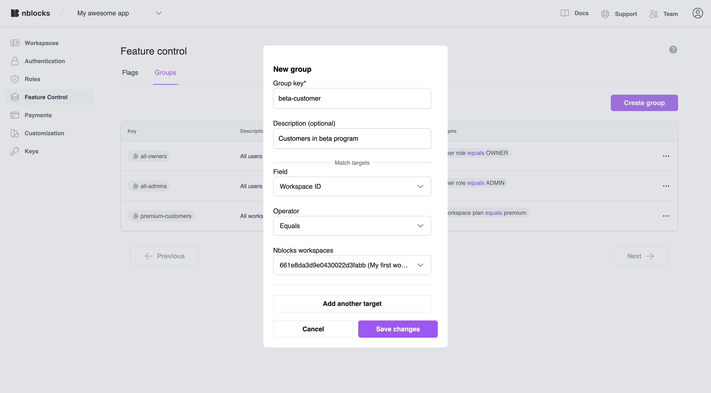

import Tabs from '@theme/Tabs';
import TabItem from '@theme/TabItem';

# Quickstart Feature Flags
On this page you will integrate your web application with Nblocks feature flags. This allows you to conditionally give access to or show / hide features or content to your users.
 
Some use cases for feature flags are: 
* Restrict access to premium content that just users with a certain plan can access
* Try beta features on a selection of customers
* Show a message to all users during a scheduled release.

**The content of this quickstart**
1. First we'll go through how you will apply a few lines of code to conditionally show content in your app.
1. Then we'll create the flag for the feature in Nblocks Admin and add a segment with conditions that should apply to it.

:::info Prerequisites

1. If you haven't already, [sign up](/docs/getting-started/signup) for Nblocks and get access to your [app id](/docs/getting-started/id-and-keys)
1. Completed the [Quickstart User Ready](/docs/authentication-and-access/quickstart-user-ready) since we'll be using the magic of access tokens in this quickstart

:::

## Integrating in your code

The integration essentially consists of requesting an evaluation of a flag by providing information about the current user.

It will be as simple as making a HTTP call to the evaluation endpoint. You can try it yourself by clicking the link below. 
[https://backendless-stage.nblocks.cloud/flags/evaluate/APP_ID/feature-name](https://backendless-stage.nblocks.cloud/flags/evaluate/APP_ID/feature-name)

What information we provide can either be as simple as the name of the user, the device name or more extensive. This is up to you and what fits your use case.

For the purpose of this quickstart we'll attach the user access token that will have Nblocks automatically resolve a lot of information when evaluating.

##### Example code
<Tabs>
<TabItem value="reactjs" label="ReactJS" default>

Create a new component called `FeatureFlags`.

```tsx
import { useEffect, useState } from 'react';

// The component takes the prop flag.
export default function FeatureFlag({ flag, children }) {

    // Replace this with your own APP ID
  const APP_ID = 'XXX';

  // This will be our variable telling if the feature is enabled or and we should render the component children
  // Initially this variable is false
  const [enabled, setEnabled] = useState(false);

  useEffect(() => {
    // Evaluate the flag
    const accessToken = window.localStorage.getItem('access_token');
    if (accessToken) {
      evaluate(accessToken);
    }
  }, []);

  const evaluate = async (accessToken) => {
    const result = await fetch(
      `https://backendless-stage.nblocks.cloud/flags/evaluate/${APP_ID}/${flag}`,
      {
        method: 'POST',
        headers: {
          'Content-Type': 'application/json',
        },
        body: JSON.stringify({
          accessToken,
        }),
      }
    ).then((res) => res.json());
    setEnabled(result.enabled);
  };

  // Only if enabled should we render the component children
  if (enabled) return children;
  else return '';
}
```

<details><summary>Providing other information than access token?</summary>

You can send whatever context information you want to the evaluation api. 
But we've simplified it using a base structure so you can build the segment targets in Nblocks Admin more easily.

The context object contains three areas, `user`, `org` and `device`. 

* Each one of them contains the property `key`. You can assign any value to this property.
* You can also assign any values you want to the other properties.
* When building the segment targets you can define is the value should be equal (`==`), contain, beginWith or endWith the value.

Structure of the body that can be sent to `/flags/evaluate`
```json
{
    context: {
        user: {
            key: "useThisAsYouWant",
            id: "63d2ab029e23db0afb07a5a7",
            role: "ADMIN",
            name: "John Doe";
        }

        org: {
            key: "useThisAsYouWant",
            id: "63d2ab029e23db0afb07a5a7",
            plan: "PREMIUM",
            name: "My Workspace"
        }

        device: {
            key: "iphone"
        }
    },
    accessToken: "XXXXXX"
}
```

:::tip

Providing the access token will automatically resolve all values for `user` and `org` so you don't have to. Read more in the [API reference](https://nebulr-group.github.io/nblocks-api-docs/#evaluate-a-flag)

:::

</details>

:::tip

Save yourself from multiple requests and check out `/flag/bulkEvaluate` endpoint in the [API reference](https://nebulr-group.github.io/nblocks-api-docs/#evaluate-flags-in-bulk)

:::

Now we can use this component anywhere in your app to conditionally show content like pages or buttons in our React app.
Like this:

```tsx
<FeatureFlag flag="release-announcement">
    <h1>We're currently doing a release and will be back soon</h1>
</FeatureFlag>
<FeatureFlag flag="premium">
    <span>This is premium content</span>
</FeatureFlag>
<FeatureFlag flag="beta-feature">
    <a href="/beta">Button to beta feature</a>
</FeatureFlag>
```

</TabItem>

</Tabs>

Now when we have the flag names sorted out and integrated in the code we can go ahead and create them in Nblocks Admin.

## Managing flags in Nblocks Admin
When signin up for Nblocks you also got access to Nblocks Admin where you can customize and make changes to your app configuration and access other features.

Go to [Nblocks Admin](https://admin-stage.nblocks.cloud) and login.

### Step 1. Add segments
Before creating the flags let's define a few segments that will match on beta customers and premium customers.

Navigate to Feature flags and click the segments tab. 
Click add segment and name it "beta-customer" and specify to match on org id using the operator "Equals" and choose one of the current workspaces that has signed up for your app.  



### Step 2. Create flag
Click the flags tab and create a new flag. Call it "beta-feature" since this is the flag we expect to evaluate in our code.

Add the "beta-customer" segment and make sure that "Enabled if match" is set to true. 
This means that the flag will be evaluated to `enabled: true` if any of the segments match on the current user.


### Step 3. Activate the flag
Flags are inactive by default protect you from making misstakes. Click on the Inactive status and toggle it to Active and click save.

## Testing it
We can now test this by logging into your app with the workspace we selected as target in the "beta-customer" segment.
You should see the content that was set with the flag `beta-feature`. 


**That's it, your now done with this quickstart**