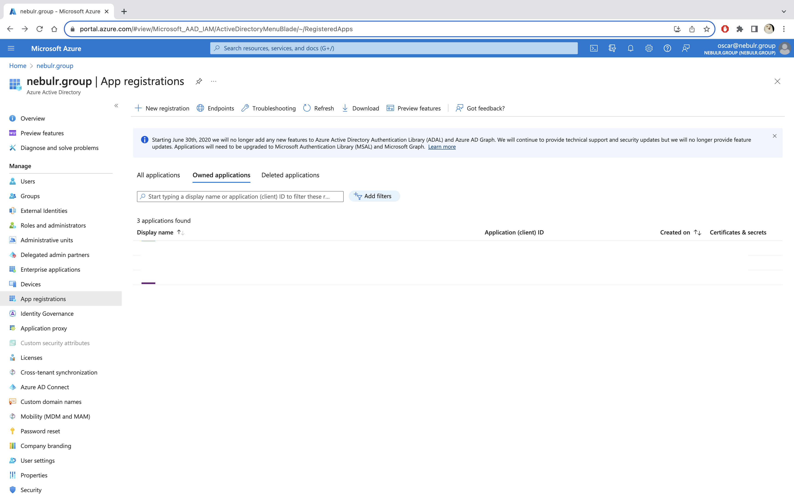
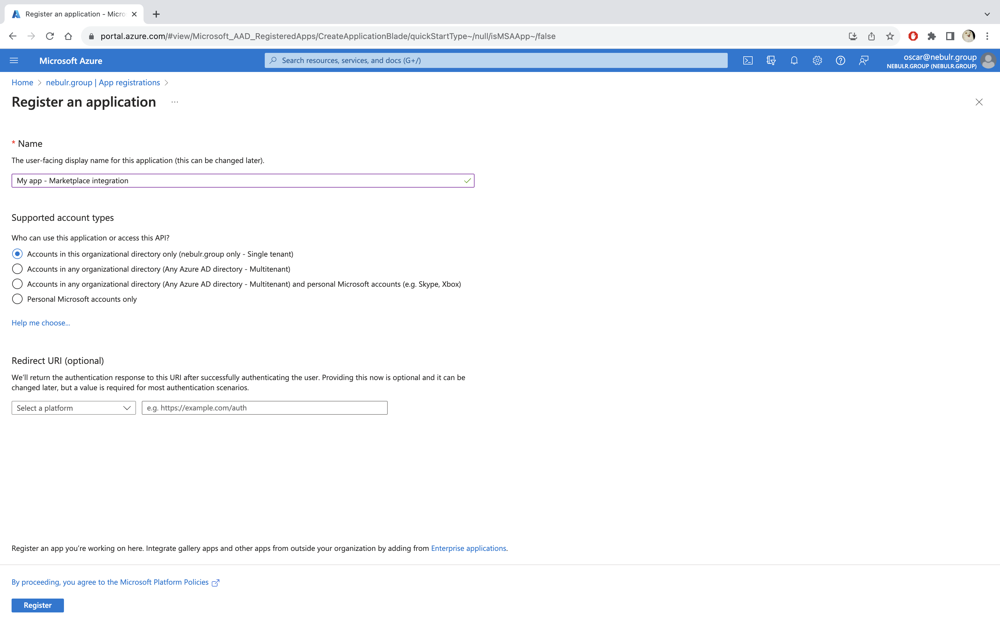
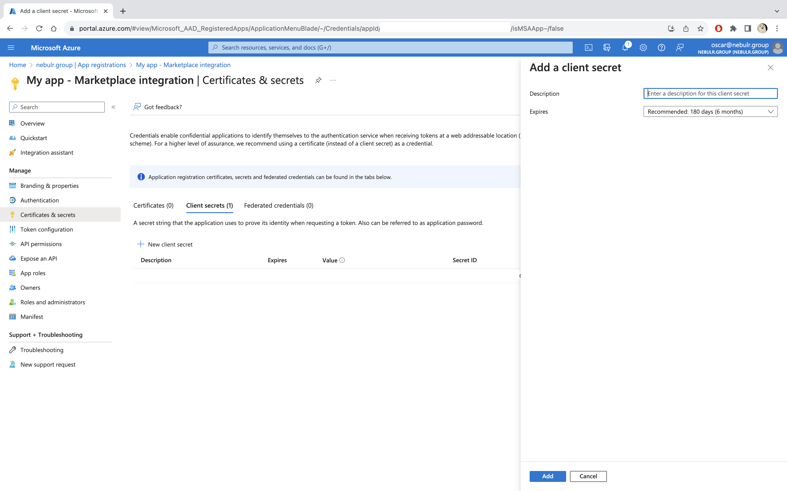
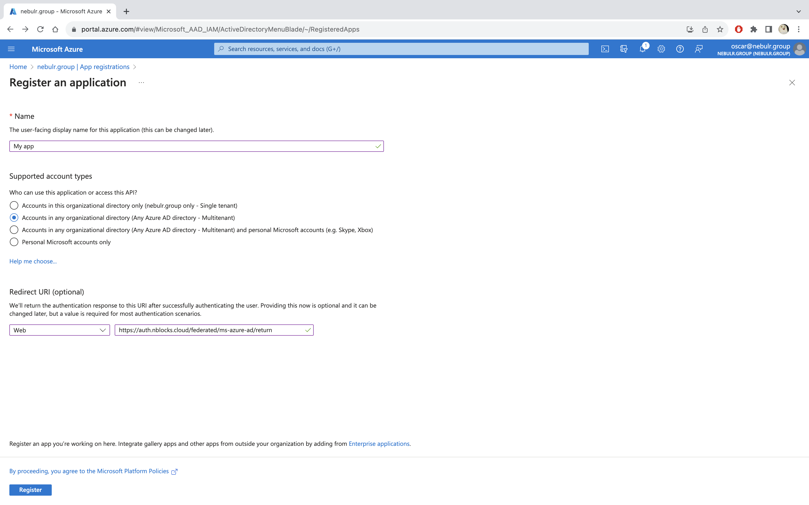
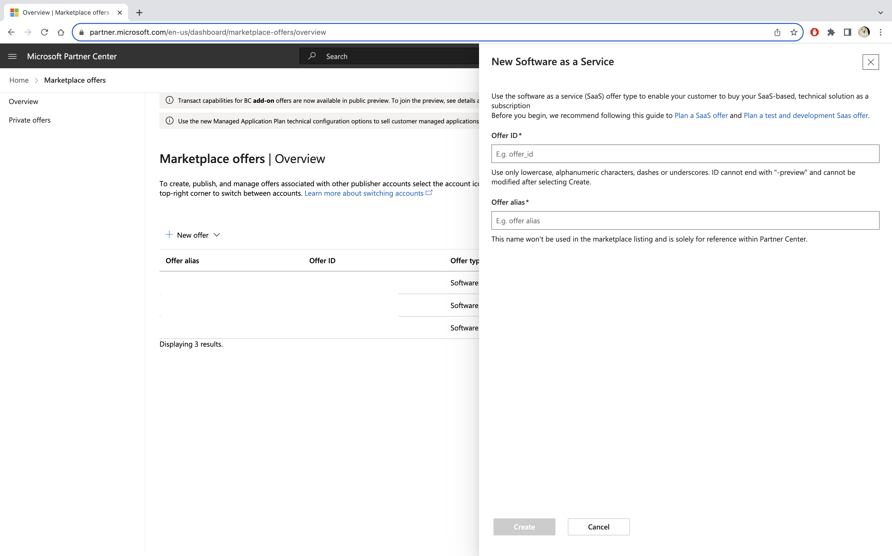
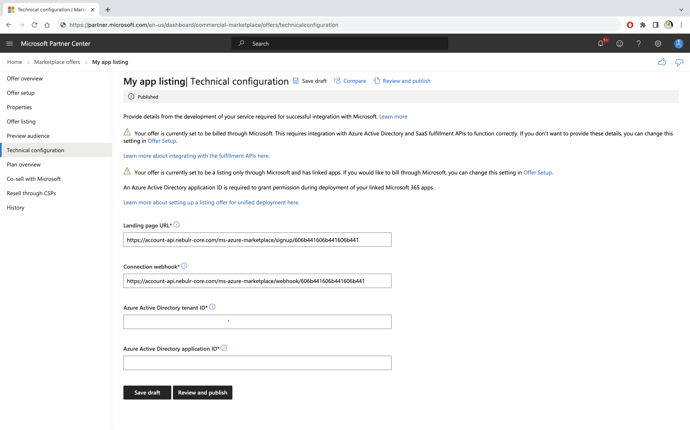

import Tabs from '@theme/Tabs';
import TabItem from '@theme/TabItem';

# Quickstart Microsoft commercial marketplace
On this page you will integrate your web application with [Microsoft commercial marketplace](https://partner.microsoft.com/en-US/partnership/the-commercial-marketplace). 
This allows you to list a transactional SaaS offer on either Azure Marketplace or Microsoft AppSource in no-time.
 
**The content of this quickstart**
1. Firstly, we'll create an app and generate secrets in Microsoft Azure portal to give Nblocks access to the integration.
1. Secondly, we'll create a new marketplace offer in Microsoft partner center and add the Nblocks landing page and connection webhook.
1. Last but not least, we'll test the integration by purchasing the offer.

:::info Prerequisites

1. If you haven't already, [sign up](/docs/getting-started/signup) for Nblocks and get access to your [app id](/docs/getting-started/id-and-keys)
1. Completed the [Quickstart User Ready](/docs/authentication-and-access/quickstart-user-ready) since we'll arriving as a new and logged in user to your app.
1. You need to signup and get access to [Microsoft Azure](https://azure.microsoft.com) and have an Azure AD tenant.
1. To be able to list offers on Microsoft commercial marketplace you need to become a [partner](https://partner.microsoft.com) and get access to Microsoft Partner Center.

:::

## Generate apps and secrets in Microsoft Azure portal

### Step 1. Create a new app registration for the marketplace integration
Go to [Azure portal](https://portal.azure.com) and login.

Click "Azure Active Directory".

Click "App registrations".


Click "New registration".

Name the new app to anything you want, select "Single tenant" as the supported account type and click "Register".



In the new app, click "Certificates & Secrets".
 
Click "New client secret" and select a suitable expiration time.



:::tip What expiration time to use?

We recommend at least 6 months so that you don't need to recreate this secrets and sync them with Nblocks all to often.

:::

Save this new secret value for a couple of minutes before we store it in Nblocks. Also save the "Application (client) ID and "Directory (tenant) ID" which is available to copy from the "Overview" tab.

### Step 2. Create new app registrations for Azure AD SSO Login
:::tip Why two app registrations?
A requirement for listing offers in the commercial marketplace is that your customers should be able to login with Azure AD for a seamless experience.

Microsoft recommends developers to register separate applications for the marketplace integration and Azure AD SSO. 
This helps separate logic of user logins and subscription management and is better from a security standpoint.

:::

Click "Azure Active Directory" -> "App registrations" -> "New registration" once again.

Name the new app to anything you want but remember that users will see this name when they login with Microsoft.
Select "Multitenant" as the supported account type.
Under "Redirect URI" select "Web" and add the URI `https://auth-stage.nblocks.cloud/federated/ms-azure-ad/return` and click "Register".



Again, click  "Certificates & Secrets" -> "New client secret" and generate a secret for this app aswell.

### Step 3. Store the Azure app secrets in Nblocks
The secrets for both the marketplace integration app aswell as the Azure AD SSO app should now be saved in Nblocks.

You should provide *Client ID*, *Client secret* and *Tenant ID* for both the marketplace integration and Azure AD SSO apps.

#### Example code

<Tabs>
<TabItem value="curl" label="cURL" default>
Copy the below cURL code and paste it into your terminal fr om anywhere.

You'll need to add your own [app api key](/docs/getting-started/id-and-keys) to the `x-api-key` header.

```shell
curl --request PUT 'https://account-api-stage.nebulr-core.com/app/credentials' \
--header 'x-api-key: YOUR_APP_API_KEY' \
--data-raw '{
    "microsoftAzureADClientId": "XXXXXXX",
    "microsoftAzureADClientSecret": "XXXXXXX",
    "microsoftAzureADTenantId": "XXXXXXX",
    "microsoftAzureMarketplaceClientId": "XXXXXXX",
    "microsoftAzureMarketplaceClientSecret": "XXXXXXX",
    "microsoftAzureMarketplaceTenantId": "XXXXXXX"
}'
```

:::tip

Curious in what more ways you can use the  `/credentials` endpoint? See the [API reference](https://nebulr-group.github.io/nblocks-api-docs/#update-credentials)

:::
</TabItem>

</Tabs>

That's all, now we will go ahead to the marketplace offer listing.

## Create a new marketplace offer
Go to [Microsoft partner center](https://partner.microsoft.com) and login.

Click "Marketplace offers".

Click "New offer", select "Software as a Service" and name your offer to anything you want.



In your new offer, click "Technical configuration".

- In "Landing page URL", add your unique landing page url which is `https://account-api-stage.nebulr-core.com/ms-azure-marketplace/signup/APP_ID`
- In "Connection webhook" add your unique webhook url which is `https://account-api-stage.nebulr-core.com/ms-azure-marketplace/webhook/APP_ID`
- In "Azure Active Directory tenant ID" add your marketplace integration app tenant id.
- In "Azure Active Directory application ID" add your marketplace integration app client id.

You'll find your app id [here](/docs/getting-started/id-and-keys)


That's all that's needed to be done for the integration!

## Test with a purchase
Before we can publish a draft and test the new offer you need to provide enough information like listing details, categorizing, different plans etc.
This process, about what is required, is well guided by microsoft.

Once that is done we can submit it for review and preview it. You'll then get a link to a preview version and test buying it.

You should see the listing, be able to purchase it, get to the Nblocks Landing page and then arrive as a new customer and logged in into your app.