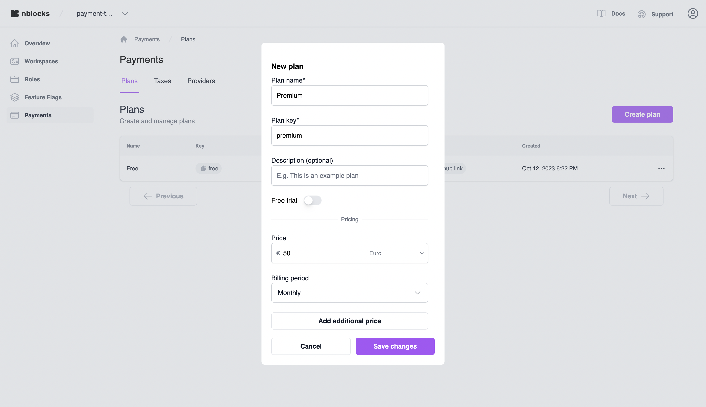
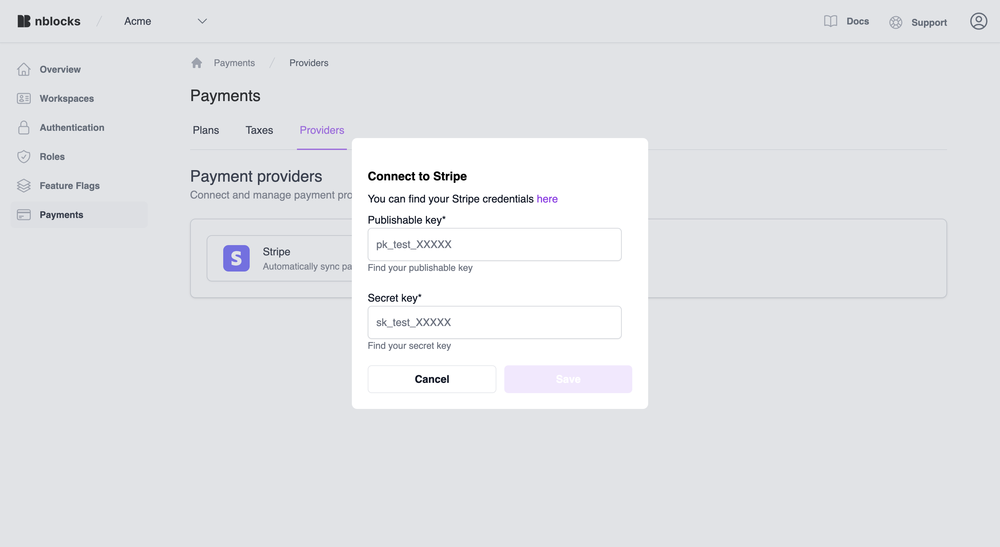
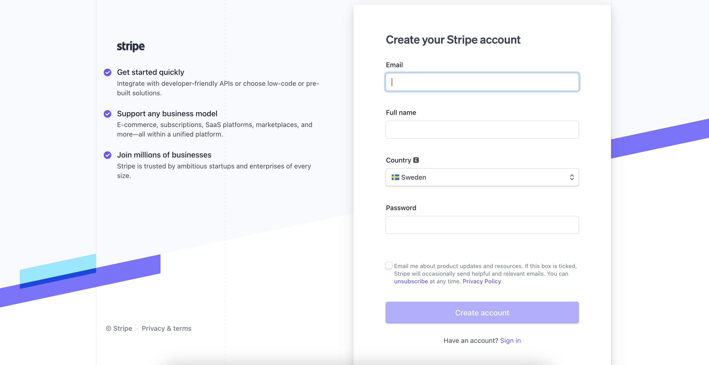
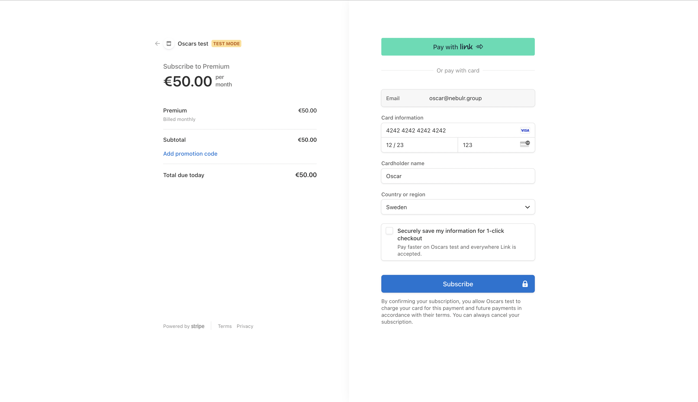

import Tabs from '@theme/Tabs';
import TabItem from '@theme/TabItem';
import PseudoCode from '../templates/_pseudo-code.mdx';


# Payments portal
On this page you will integrate your web application with Nblocks Payments portal.   
The payments portal exists so you can embedd ready made payments views straight into your app either by using Iframes or redirecting the user to it.
This allows you add a paywall and start recieving money through subscriptions from your customers in matter of minutes.
 
**The content of this quickstart**
1. First we'll go through how you will apply a few lines of code to setup your app for paying users.
1. Secondly, we'll define a simple business model with plans and prices via Nblocks Admin and enable syncing with Stripe.
1. Lastly we'll be testing this by signing up as a new user where we will selecting a plan and get access to your app.

:::info Prerequisites

1. If you haven't already, [sign up](/docs/getting-started/signup) for Nblocks and get access to your [app id](/docs/getting-started/id-and-keys)
1. Completed the [Quickstart](/docs/getting-started/quickstart) since we'll be evolving on the token callback handler in this quickstart

:::

## Integrating in your code

### Step 1. Create subscription button
In this step we will coding a button and component that will redirect the user to the Nblocks hosted Select plan view to manage can manage their current plan and subscription.

There will be two Nblocks endpoints involved when requesting to render the select plan.
1. First we need to get the [handover code](https://nebulr-group.github.io/nblocks-api-docs/#handover-code) which is unique to the user. This is done using `/handover/code` endpoint.
1. Then we will use the code to redirect to the [select plan view](https://nebulr-group.github.io/nblocks-api-docs/#subscription-portal-select-plan) using the `/subscription-portal/selectPlan` endpoint.

##### Example code
<Tabs>
<TabItem value="reactjs" label="ReactJS" default>

Create a new component `SelectPlan`.

```jsx
import React, { useEffect } from "react";
import { APPLICATION_ID, NBLOCKS_AUTH, NBLOCKS_BACKENDLESS } from "../nblocks/Globals";

function SelectPlan() {
  const redirectToSelectPlan = async (accessToken) => {

    // Replace this with your own APP ID
    const APP_ID = "XXX";

    // Make the API call to Nblocks
    const handoverCodeResult = await fetch(`https://auth.nblocks.cloud/handover/code/${APP_ID}`,
      {
        method: "POST",
        headers: {
          "Content-Type": "application/json",
        },
        body: JSON.stringify({
          accessToken,
        }),
      }
    ).then(res => res.json());
    
    if(handoverCodeResult.code) {
      // Redirect to Nblocks Payments
      window.location.replace(`https://backendless.nblocks.cloud/subscription-portal/selectPlan?code=${handoverCodeResult.code}`); 
    }
  };

  useEffect(() => {
    const accessToken = window.localStorage.getItem('access_token');
    if (accessToken) {
      redirectToSelectPlan(accessToken);
    }
  }, [])

  return <div>Loading...</div>
}

export { SelectPlan }
```

Add this component to render on the route `/selectPlan` and create a subscription button that navigates the user to this route.

```jsx
<sidebar>
  <ul class="menu">
      <li>
          <a href="/home">Home</a>
      </li>
      <li>
          // highlight-start
          <a href="/selectPlan">Subscription</a>
          // highlight-end
      </li>
  </ul>
</sidebar>
```

Great! When you render this component the user will be redirected to select plan view. 
</TabItem>

<TabItem value="java" label="Java">

Create a new servlet called `PaymentServlet`.

```java
package com.mycompany.app;

import java.io.IOException;
import java.net.URI;
import java.net.http.HttpClient;
import java.net.http.HttpRequest;
import java.net.http.HttpResponse;
import org.json.JSONObject;

import javax.servlet.ServletException;
import javax.servlet.http.HttpServlet;
import javax.servlet.http.HttpServletRequest;
import javax.servlet.http.HttpServletResponse;

public class PaymentServlet extends HttpServlet {
    // Replace this with your own APP ID
    // highlight-start
    private static final String APP_ID = "XXX";
    // highlight-end
    private static final String HANDOVER_URL = "https://auth.nblocks.cloud/handover/code/" + APP_ID;
    private static final String PAYMENT_URL = "https://backendless.nblocks.cloud/subscription-portal/selectPlan?code=";

    @Override
    protected void doGet(HttpServletRequest request, HttpServletResponse response)
            throws ServletException, IOException {

        try {
            // Extract the access token from the Authorization header
            String authHeader = request.getHeader("Authorization");
            String accessToken = authHeader.substring("Bearer ".length());

            // Prepare the request
            JSONObject requestBody = new JSONObject().put("accessToken", accessToken);

            HttpRequest flagsRequest = HttpRequest.newBuilder()
                    .uri(URI.create(HANDOVER_URL))
                    .header("Content-Type", "application/json")
                    .POST(HttpRequest.BodyPublishers.ofString(requestBody.toString()))
                    .build();

            // Send the request
            HttpClient client = HttpClient.newHttpClient();

            HttpResponse<String> handoverResponse = client.send(flagsRequest, HttpResponse.BodyHandlers.ofString());
            // Extract handover code from response
            JSONObject handover = new JSONObject(handoverResponse.body());
            String handoverCode = handover.getString("code");
            
            if (handoverCode == null) {
                throw new Exception("Handover code is null");
            }
            
            // Redirect to Nblocks Payments
            response.sendRedirect(PAYMENT_URL + handoverCode);
            return;
        } catch (Exception e) {
            e.printStackTrace();
            return;
        }
    }
}
```

Add this servlet to your app under a `/payment` endpoint:
```java
package com.mycompany.app;

import java.util.EnumSet;
import java.util.List;

import javax.servlet.DispatcherType;

import org.eclipse.jetty.server.Server;
import org.eclipse.jetty.servlet.FilterHolder;
import org.eclipse.jetty.servlet.ServletContextHandler;
import org.eclipse.jetty.servlet.ServletHolder;

public class App {

    public static void main(String[] args) throws Exception {
        Server server = new Server(8080);

        ServletContextHandler context = new ServletContextHandler(ServletContextHandler.SESSIONS);
        context.setContextPath("/");
        server.setHandler(context);

        // ... other endpoints
        // highlight-start
        context.addServlet(new ServletHolder(new PaymentServlet()), "/payment");
        // highlight-end

        server.start();
        server.join();
    }
}
```

Great! When you call the `/payment` endpoint the user will be redirected to select plan view. 
</TabItem>

<TabItem value="pseudo" label="Can't find your stack?" default>
  <PseudoCode/>
</TabItem>

</Tabs>

:::tip 

Nblocks will attach payment information to the access token you recieve on the callback route. 
If `shouldSelectPlan` or `shouldSetupPayments` is set to `true` you should redirect the user to `/selectPlan`.

:::

## Create plans in Nblocks Admin
When signing up for Nblocks you also got access to Nblocks Admin where you can customize and make changes to your app configuration and access other features.

Go to [Nblocks Admin](https://admin.nblocks.cloud) and login.

In this part we'll be creating a feature flag that matches your flag ID in code and define who should have access to it

### Step 1. Create a premium plan
Click the payments tab and create a new plan. Call it "Premium", keep free trial disabled and give it a price of 50 EUR a month. We'll subscribe to this plan when we test the integration.



Now when we have the plans ready, it's time to start enable the Stripe integration so that we can charge credit cards and handle invoicing. 

### Step 2. Enable syncing with Stripe
Nblocks uses [Stripe](https://stripe.com) as the payment provider to facilitate credit card, invoice, wallet and bank transfer payments.

Click the "Providers" tab and click to enable Stripe as a provider. Nblocks will ask for your Stripe Publishable key and Secret key.



If you don't have a Stripe account already, go to https://stripe.com and register for a new one.



Inside the Stripe dashboard, navigate to [test API keys](https://dashboard.stripe.com/test/apikeys) by clicking the "Developers" button and then "API keys", making sure "Test mode" is enabled.

:::tip Why test API keys?

With the test keys, we'll be able to add a non existing test credit card and simulate a successful payment when subscribing to your Premium plan.

:::

Under "Standard keys" you'll find your Publishable key and Secret key. Add them to the Nblocks input and click Save.

Nblocks will now create the required information in your stripe account to enable payments and keep this information in-sync as long as you have the integration enabled.

## Test signing up and subscribe to a plan
It's time to see this in action.

### 1. Start your app
Start your application so that it is accessible on [http://localhost:8080](http://localhost:8080)

### 2. Navigate to /login and get redirected to Nblocks Login to signup
Navigate to [http://localhost:8080/login](http://localhost:8080/login). Your code redirects the user to Nblocks Login.
Or you can go directly to [https://auth.nblocks.cloud/signup/APP_ID](https://auth.nblocks.cloud/signup/APP_ID) where APP_ID is your Nblocks app id to start a signup flow.


### 3. Select plan
After signing up you're immediately redirected to Select plan that shows you're about to subscribe to the Premium plan.


Click to continue with the Premium plan and enter your credit card information.

### 4. Enter payment information


:::tip Use the test credit card

|          |                      |          |          |         |          |          |         |
| -------- | -------              | -------- | -------- | ------- | -------- | -------- | ------- |
| Number   | 4242 4242 4242 4242  |          | Expires  | 12/45   |          | CVC      | 123     | 

:::

### 5. Return to the app
After a succesfull checkout you're redirected back to the app and your subscribing to Premium for 50 Eur / month.