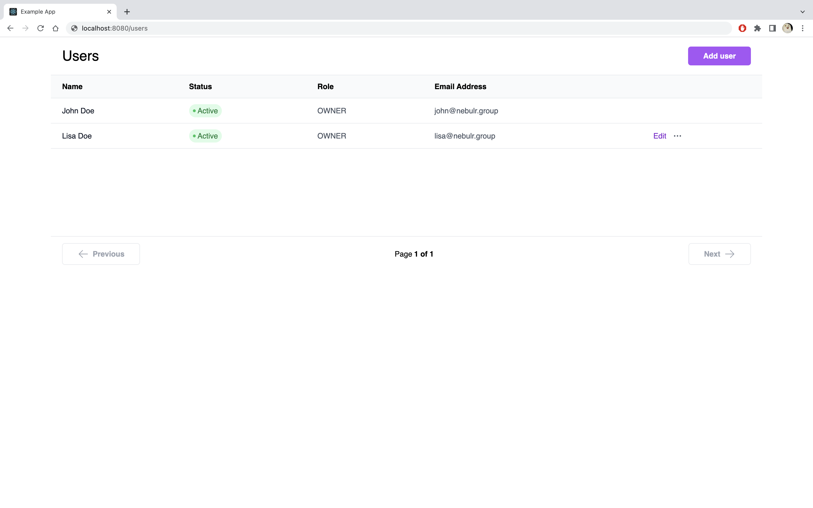

import Tabs from '@theme/Tabs';
import TabItem from '@theme/TabItem';

# User management portal
The user management portal exists so you can embedd ready made user management views straight into your app either by using Iframes or redirecting the user to it.

## User list
The user list let's you render a ready made view to let the logged in user manage the workspace and invite other users to it.



### Implement it

:::tip

The url can either be rendered as an Iframe or you can redirect the user to it.
:::

There will be two Nblocks endpoints involved when requesting to render the user list.
1. First we need to get the [handover code](https://nebulr-group.github.io/nblocks-api-docs/#handover-code) which is unique to the user. This is done using `/handover/code` endpoint.
1. Then we will use the code to render the [user list view](https://nebulr-group.github.io/nblocks-api-docs/#user-management-portal-users) using the `/user-management-portal/users` endpoint.

#### Example code
<Tabs>
<TabItem value="reactjs" label="ReactJS" default>

Create a new component that we call UserList.

```tsx
export default function UserList() {
  const [url, setUrl] = useState();

  const APP_ID = "XXX";

  useEffect(() => {
    createUrl();
  }, []);

    const createUrl = async () => {
    // Retrieve the access token JWT from localstorage
    const accessToken = window.localStorage.getItem("access_token");

    // Get the handover code from Nblocks
    const result = await fetch(
      `https://auth-stage.nblocks.cloud/handover/code/${APP_ID}`,
      {
        method: "POST",
        headers: {
          "Content-Type": "application/json",
        },
        body: JSON.stringify({
          accessToken,
        }),
      }
    ).then((res) => res.json());

    // Create the user management portal url
    setUrl(
      `https://backendless-stage.nblocks.cloud/user-management-portal/users?code=${result.code}`
    );
  };

  // Render the url as an iframe
  return <iframe width="100%" height="500px" src={url}></iframe>;
}

```

:::tip How to get the access token?

In the User Login Quickstart, we stored the access token into Localstorage as a fast and easy way later retrieve it again. Other ways could be to save in-memory in a global state or React context.
:::

</TabItem>

<TabItem value="angular" label="Angular" default>

</TabItem>

<TabItem value="pseudo" label="Can't find your stack?" default>

</TabItem>

</Tabs>
