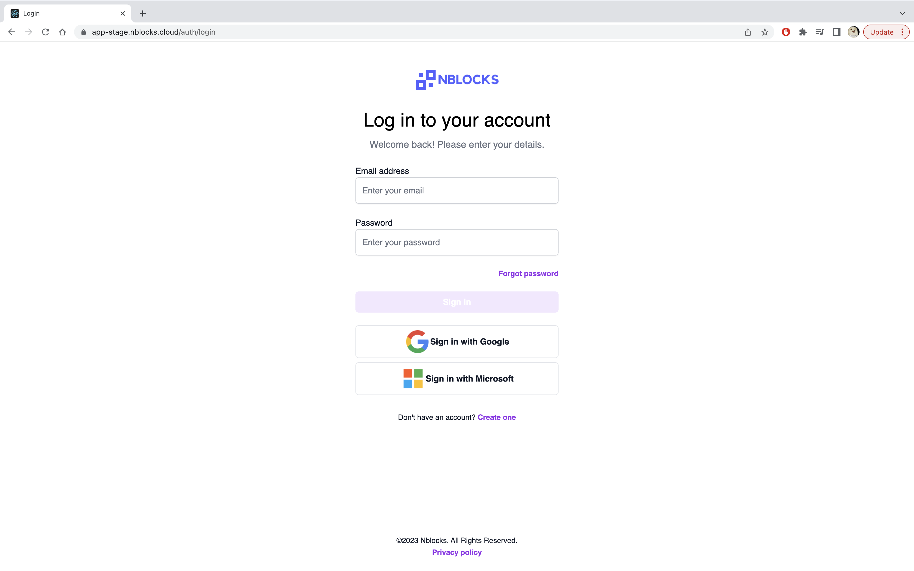
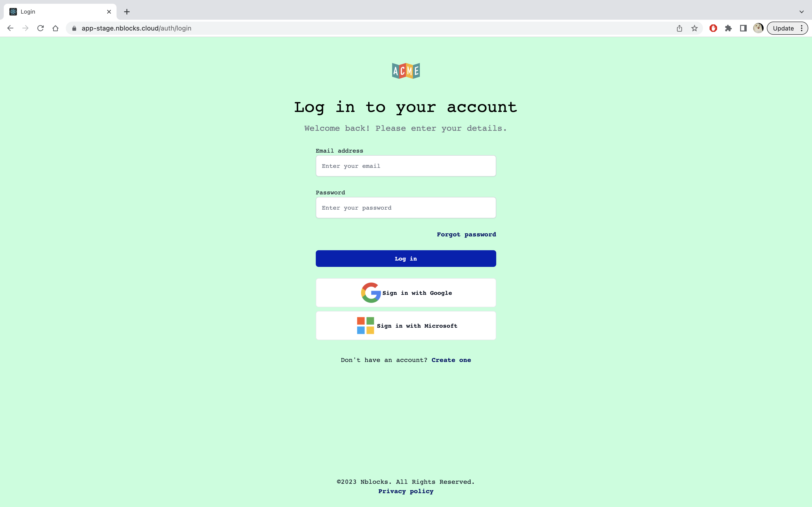

import Tabs from '@theme/Tabs';
import TabItem from '@theme/TabItem';

# Quickstart Branding

In this quickstart we'll apply branding to the Nblocks hosted views like Nblock Login and User management portal.

We'll accomplish this in three steps:
1. Change the logo
1. Change the colors and fonts using CSS
1. Override a specific button text with our own text

At the end of this quickstart you'll take the default brand from this.



To something like this:



:::info Prerequisites

1. If you haven't already, [sign up](/docs/getting-started/signup) for Nblocks and get access to your [app id and api key](/docs/getting-started/id-and-keys) 

:::

## Step 1. Change your logo
First up is changing the logo. Your logo is displayed on both Nblocks login and emails that Nblocks sends on your behalf. The logo is part of your app profile and can easily be changed by pushing an updated JSON body with the `logo` property to the `/app` endpoint.

The `logo` property should be URL to a image on the internet. Here's an example:

```json
{
    "logo": "https://nebulr-public-assets.s3.eu-west-1.amazonaws.com/acme-logo.png"
}
```

#### Example code

<Tabs>
<TabItem value="curl" label="cURL" default>

Copy the below cURL code and paste it into your terminal from anywhere.

You'll need to add your own [app api key](/docs/getting-started/id-and-keys) to the `x-api-key` header.

```shell
curl --location --request PUT 'https://account-api-stage.nebulr-core.com/app' \
--header 'x-api-key: XXXX' \
--header 'Content-Type: application/json' \
--data '{
    "logo": "https://nebulr-public-assets.s3.eu-west-1.amazonaws.com/acme-logo.png"
}'
```

:::tip

Curious in what more ways you can use the  `/app` endpoint? See the [API reference](https://nebulr-group.github.io/nblocks-api-docs/#update-app-profile)

:::
</TabItem>

</Tabs>

## Step 2. Change the styling using custom CSS

We're going to change the brand primary color, the body background and also the font-family. This can be done with a CSS file like this:

```css
html,body { background-color: #00ff8629 !important; }

:root {
    --color-primary-50: 0 48 255;
    --color-primary-100: 0 43 230;
    --color-primary-200: 0 38 204;
    --color-primary-300: 0 34 179;
    --color-primary-400: 0 29 153;
    --color-primary-500: 0 24 128;
    --color-primary-600: 0 19 102;
    --color-primary-700: 0 14 76;
    --color-primary-800: 0 10 51;
    --color-primary-900: 0 0 0;

    --font-body: monospace !important;
    --font-paragraph: monospace !important;
    --font-heading: monospace !important;
}
```

:::tip
You can see more examples and a base CSS file in the [API reference](https://nebulr-group.github.io/nblocks-api-docs/#set-custom-css)
:::

#### Example code

<Tabs>
<TabItem value="curl" label="cURL" default>

Copy the below cURL code and paste it into your terminal from anywhere.

You'll need to add your own [app api key](/docs/getting-started/id-and-keys) to the `x-api-key` header.

```shell
curl --location 'https://backendless-stage.nblocks.cloud/brand/css' \
--header 'x-api-key: XXXX' \
--header 'Content-Type: application/json' \
--data '{
    "content": "html,body { background-color: #00ff8629 !important; } :root { --color-primary-50: 0 48 255; --color-primary-100: 0 43 230; --color-primary-200: 0 38 204; --color-primary-300: 0 34 179; --color-primary-400: 0 29 153; --color-primary-500: 0 24 128; --color-primary-600: 0 19 102; --color-primary-700: 0 14 76; --color-primary-800: 0 10 51; --color-primary-900: 0 0 0; --font-body: monospace !important; --font-paragraph: monospace !important; --font-heading: monospace !important; }"
}'
```

</TabItem>

</Tabs>


## Step 3. Change a text entry using custom translation
In the final step, we're going to override the translations by providing a JSON body of key value pairs. Here we want to change the login button to say "Log in" instead of "Sign in".

```json
{
    "Sign in": "Log in"
}
```
:::tip
You can see more examples and a complete translation file in the [API reference](https://nebulr-group.github.io/nblocks-api-docs/#set-custom-translations)
:::

#### Example code

<Tabs>
<TabItem value="curl" label="cURL" default>

Copy the below cURL code and paste it into your terminal from anywhere.

You'll need to add your own [app api key](/docs/getting-started/id-and-keys) to the `x-api-key` header.

```shell
curl --location 'https://backendless-stage.nblocks.cloud/brand/translations' \
--header 'x-api-key: XXXX' \
--header 'Content-Type: application/json' \
--data '{
    "Sign in": "Log in"
}'
```

</TabItem>

</Tabs>

## Test it
To see how the new branding was applied you can open up a new tab and navgigate to Nblocks Login.

Copy this link, paste it into a new browser tab and replace the APP_ID to your own app id
```
https://auth-stage.nblocks.cloud/url/login/APP_ID
```

**That's it!** You're done with this quickstart.