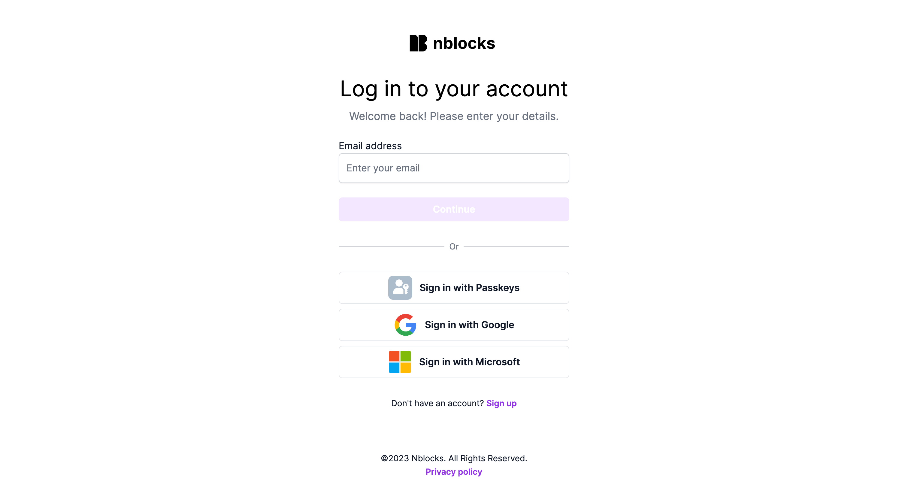
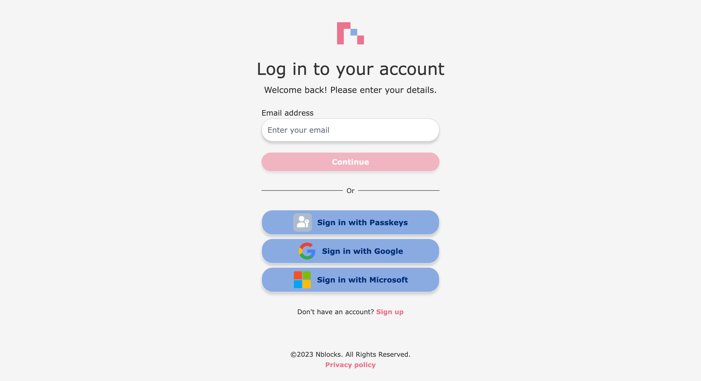

import Tabs from '@theme/Tabs';
import TabItem from '@theme/TabItem';

# Branding

The **Customization** page within the [Nblocks Admin Portal](https://admin.nblocks.cloud) enables you to tailor the appearance of Nblocks-hosted views, such as the login and user management portal, to your brand guidelines.

This quickstart will guide you from the default brand display:



Into a customized, branded interface:



:::info Prerequisites

Before proceeding, ensure you have an account by [signing up](/docs/getting-started/signup) with Nblocks.

:::

We will achieve this by:
* Modifying our app properties, including the name and logo
* Use the brand designer to set colors and fonts

## App Properties


Here, you can update your app's name and provide links to your privacy policy and terms of service. Additionally, you have the option to upload your own logo, which will be displayed on the Nblocks login and in the emails Nblocks sends on your behalf.


:::tip

Interested in exploring more app properties? See the [API reference](https://nebulr-group.github.io/nblocks-api-docs/#update-app-profile).

:::

## Brand Designer


To easily customize your Nblocks theme, use the brand designer. Here, you can adjust:
* **Font**
* **Colors** for the background, text, and buttons
* **Border Radius** in your preferred unit
* **Drop Shadow** for input fields and buttons

Your changes will appear in the preview to the right.

Select *Reset to default* to revert to the original branding and remove all custom settings in the brand designer.

For more precise control beyond what the designer offers, switch to the *Custom mode*.

### Custom Mode


Custom Mode allows you to upload your own CSS file, offering complete control over your branding.

:::tip
You can see how to accomplish this using the API and access an example CSS file in the [API reference](https://nebulr-group.github.io/nblocks-api-docs/#set-custom-css)
:::

## Testing Your Branding
To view your new branding, open a new browser tab and navigate to the Nblocks Login page.
Copy the following link, paste it into a new tab, and substitute 'APP_ID' with your specific app identifier:

```
https://auth.nblocks.cloud/url/login/APP_ID
```

**That's it!** You're now ready to start designing your app.